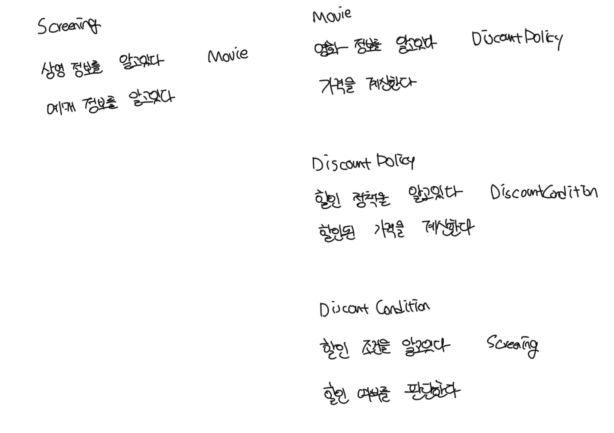

# 책임이란?

- 협력에 참여하기 위해서 객체가 수행하는 행동을 `책임`이라고 부른다
- 객체의 책임은 `무엇을 알고 있는지`와 `무엇을 할 수 있는지`로 구분된다
- 크게는 `아는 것(knowing)`과 `하는 것(doing)`으로 구분된다

 

### 하는 것(Doing)

- 객체를 생성하거나 계산을 수행하는 등의 스스로 하는 것
- 다른 객체의 행동을 시작시키는 것
- 다른 객체의 활동을 제어하고 조절하는 것

 

### 아는 것(Knowing)

- 사적인 정보에 관해서 아는 것
- 관련된 객체에 관해서 아는 것
- 자신이 유도하거나 계산할 수 있는 것에 관해 아는 것

 

### 영화 앱에서의 역할과 책임

 

### 책임과 메세지의 크기

- 책임은 객체가 수행할 수 있는 행동을 종합적이고 간략하게 서술하기 때문에 메세지보다 추성적이고 개념적으로도 더 크다
- 책임의 관점에서 아는것과 하는것이 밀접하게 연관되어 있는데, 객체는 자신이 맡을 책임을 수행하는 데 필요한 정보를 알고 있을 책임이 있다
- 객체지향 설계에서 가장 중요한것은 책임이다. 얼마나 적절한 책임을 할당하는지가 설계의 전체적인 품질을 결정한다

 

# 책임 할당

- 자율적인 객체를 만드는 가장 기본적인 방법은 책임을 수행하는데 필요한 정보를 가장 잘 알고 이는 전문가에게 그 책임을 할당하는 것임
  - 책임 할당을 위한 `정보 전문가 패턴(Information Expert Pattern)`이라고 부른다
- 책임을 할당하기 위해서는 먼저 협력이라는 문맥을 정의하는데 협력을 설계하는 출발점은 시스템이 사용자에게 제공하는 기능을 시스템이 담당할 하나의 책임으로 바라보게 하는것임
- 객체지향 설계는 시스템의 책임을 완료하는데 필요한 더 작은 책임을 찾아내고 이를 객체들에게 할당하는 반복적인 과정을 통해서 모양을 갖춰감
- 협력을 설계하면서 최종적으로 얻게되는 결과물은 시스템을 구성하는 객체들의 인터페이스와 오퍼레이션 목록이다

 

# 책임 주도 설계

- 책임을 갖고 책임을 수행할 적절한 객체를 찾아서 책임을 할당하는 방식으로 협력을 설계하는 방식을 `책임 주도 설계(Responsibility-Driven Design)`라고 부른다

 

### 책임 주도 설계방법 정리

- 제공해야 하는 기능인 시스템 책임을 파악하고, 더 작은 책임으로 분리
- 분할된 책임을 수행할 수 있는 적절한 객체 또는 역할을 찾아서 책임을 할당
- 책임을 수행하는 도중 다른 객체의 도움이 필요하다면, 이를 책임을 객체나 역할을 탐색
- 해당 객체 또는 역할에게 책임을 할당함으로써 두 객체가 협력하게됨

 

### 협력은 객체를 설계하기 위한 구체적인 문맥을 제공

- 책임 주도 설계는 자연스럽게 객체의 구현이 아닌 책임에 집중할 수 있게 해준다
- 유연하고 결고한 객체지향 시스템을 위해 가장 중요한 재료가 바로 책임이다
- 메세지가 객체를 결정하고, 행동이 상태를 결정하게된다

 

# 메세지가 객체를 결정한다

- 객체는 책임을 할당하는 데 필요한 메세지를 먼저 식별하고 처리할 객체를 나중에 식별함
- 이 는 객체가 메세지를 선택하는게 아니라, 메세지가 객체를 선택한다는 뜻이다
- 추상적이면서도 미니멀리즘을 따르는 인터페이스를 가지기 위해서는 메세지가 객체를 선택하게 해야함

 

### 최소한의 인터페이스(Minimal Interface)

- 필요한 메세지가 식별될 때 까지 객체의 공개 인터페이스에는 아무것도 추가하지 않음
- 이는 객체가 앱에 크지도, 작지도 않은 꼭 필요한 크기의 퍼블릭 인터페이스를 가지게됨

 

### 추상적인 인터페이스(Abstract Interface)

- 인터페이스는 `무엇(what)`을 수행하는지만 정의하고 `어떻게(how)` 수행하는지는 노출하지 않음

 

# 행동이 상태를 결정한다

- 객체가 존재하는 이유는 협력에 참여하기 위해서다
- 객체를 객체답게 만드는 것은 객체의 상태가 아닌, 객체가 다른 객체에게 제공하는 행동이다
- 객체지향 패러다임에서 가장 쉽게 빠지는 실수는 객체의 행동이 아닌 상태에 초점을 맞추는것이다
- 이처럼 객체의 내부 구현에 초점을 맞춘 설계를 `데이터 주도 설계(Data-Driven Design)`이라고 부른다
- 하지만 상태와 행동이 아닌 시스템의 기능을 구현하기 위한 협력에 초점을 맞춰야만 응집도가 높고 결합도가 낮은 객체 창조가 가능하다
- 상태는 단지 객체가 행동을 정상적으로 수행하기 위해서 필요한 재료일뿐이다
