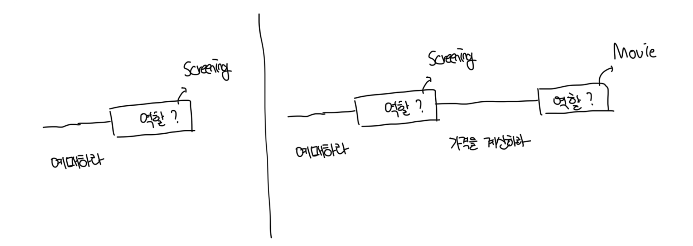
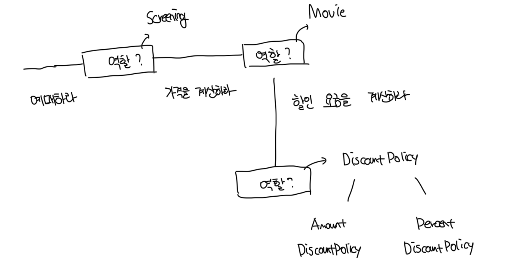
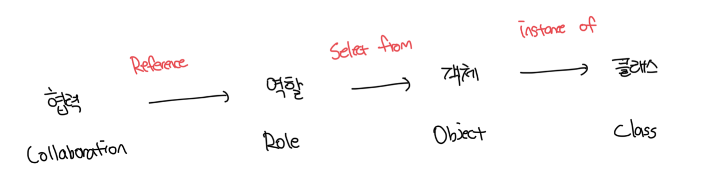

# 역할

- 객체가 어떤 특정한 협력 안에서 수행하는 책임의 집합을 역할이라고 부른다
- 영화 앱의 경우는 먼저 `영화를 예매할 수 있는 역할`을 찾고, 이후에 해당 역할을 수행할 객체로 `Screening` 인스턴스를 선택한다

 

# 유연하고 재사용이 가능한 협력

- 역할이 중요한 이유는 역할을 통해서 유연하고 재사용 가능한 협력을 얻을 수 있다
- 만약 영화에 할당된 `가격을 계산하라` 책임에서 `할인요금을 계산하라`라는 메세지를 각 `AmountDiscountPolicy`, `PercentDiscountPolicy`에게 각각 전달한다면 중복코드가 발생할것이다
- 코드 중복은 모든 문제의 근원이기 때문에 이런 방법은 피하는게 좋다
- 문제 해결을 위해서는 객체가 아닌 책임에 초점을 맞추는게 좋은데, 위 2개의 정책은 같은 책임을 수행한다
- 이처럼 역할을 이용하면 중복 코드 제거가 가능하다
- 따라서 `책임과 역할을 중심으로 협력을 바라보는 것`이 변경과 확장이 용이한 유연한 설계로 나아가는 첫걸음이다

 

# 객체 vs 역할

- 역할은 객체가 참여할 수 있는 일종의 슬롯이다
- 협력에 참여하는 후보가 여러 종류의 객체에 의해서 수행될 필요가 있다면 그 후보는 역할이 된다
- 하지만 단지 한 종류의 객체만이 협력에 참여할 필요가 있다면 후보는 객체가 된다

 

### 협력, 역할, 객체, 클래스의 관계

 

### 도메인 모델

- 모데인 모델 안에는 개념, 객체, 역할이 어지럽게 뒤섞여 있으며 이는 사람들이 세계를 바라보는 일반적인 관점임
- 사람들은 세상을 이해할 때 무의식적을 개념, 객체, 역할을 뒤섞는데 이는 동시에 불완전성을 가질수 밖에 없음

 

### 역할 모델링(Role Modeling)

- 다양한 객체들이 협력에 참여한다는 것이 확실하다면 역할로 시작한다
- 모든것이 안개에 둘러싸여있고, 정확한 결정을 내리기 어려운 상황이면 구체적인 객체로 시작한다
- 다양한 시나리오를 탐색하고 유사한 협력들을 단순화하고 합치다 보면 자연스럽게 그 역할이 나타난다
- 이처럼 역할을 설계의 중심 개념으로 보는 개념이 `역할 모델링(Role Modeling)`이다
- 협력을 구체적인 객체가 아니라 추상적인 역할의 관점에서 설계하면 협력이 유연하고 재사용이 가능해진다

 

# 역할과 추상화

- 추상화를 이용한 설계가 가질 수 있는 장점은 다음과 같다
  - 추상화 계층만을 이용하면 중요한 정책을 상위 수준에서 결정이 가능하다
  - 설계가 좀 더 유연해진다
- 역할은 공통의 책임을 바탕으로 객체의 종류를 숨기기 때문에 이런 관점에서 역할을 객체의 추상화로 볼 수 있다

 

### 상위 수준에서 정책 결정하기

- 세부 사항에 억눌리지 않고도 상위 수준의 정책을 쉽게 간단하게 표현한다
- 협력이라는 관점에서는 세부적인 사항을 무시하고, 추상화에 집중하는게 유용하다
- 영화 앱에서는 요금계산을 위해서 `할인 정책`과 `할인 조건`만 바라본다

 

### 설계를 유연하게 만들기

- 역할은 다양한 종류의 객체를 끼워넣을 수 있는 일종의 슬롯이라는 점을 기억하다
- 협럭 안에서 동일한 책임을 수행하는 객체들은 동일한 역할을 수행하므로 서로 대체가 가능하다
