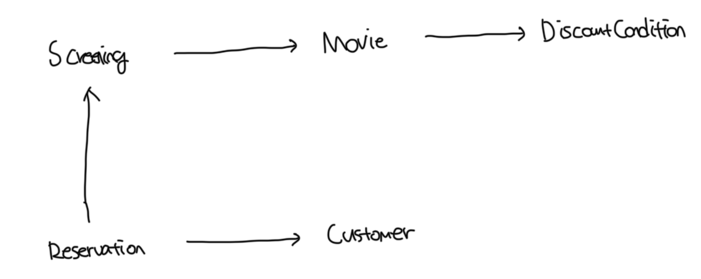

# 시스템을 객체로 분할하는 방법

- 결론은 훌룡한 객체지향 설계는 데이터가 아닌 책임에 초점을 맞춰야함
-

### 상태를 분할의 중심축으로 사용

- 객체는 자신이 포함하고 있는 데이터를 조작하는 데 필요한 오퍼레이션을 정의함
- 객체를 독립된 데이터 덩어리로 바라봄
- 즉 객체의 상태에 초점을 맞춤
- 객체는 상태의 구현에 속한다. 하지만 구현을 불안정하므로 변하기 쉽다
- 데이터에 초점을 맞추는 설계는 변경에 취약할 수밖에 없다

<br>

### 책임을 분할의 중심축으로 사용

- 다른 객체에서 요청할 수 있는 오퍼레이션을 위해 필요한 상태를 보관함
- 객체를 협력하는 공동체의 일원으로 바라봄
- 즉 객체의 행동에 초점을 맞춤
- 객체의 책임은 인터페이스에 속한다
- 책임을 드러내는 안정적인 인터페이스 뒤로 책임을 수행하는데 필요한 상태를 캡슐화해서 구현 변경에 대한 파장이 외부로 퍼져나가는걸 방지한다

<br>

# 데이터를 준비하자

- 데이터 중심의 설께란 객체 내부에 저장되는 데이터를 기반으로 시스템을 분할하는 방식이다
- 객체가 내부에 저장해야 하는 데이터가 무엇인가를 묻는것부터 시작된다
- 데이터 중심 설계에서는 객체가 포함해야 하는 데이터에 집중한다

<br>

### Movie

```ts
import DiscountCondition from "./conditions/discount-condition.js";
import Duration from "./duration.js";
import Money from "./money.js";

const MovieType = {
  AMOUNT_DISCOUNT: "AMOUNT_DISCOUNT", // 금액 할인 정책
  PERCENT_DISCOUNT: "PERCENT_DISCOUNT", // 비율 할인 정책
  NONE_DISCOUNT: "NONE_DISCOUNT", // 미적용
} as const;

type MovieType = (typeof MovieType)[keyof typeof MovieType];

export default class Movie {
  /**
   * 기존 책임 주도 설계에서 정의된 상태들
   *
   * title: 영화 제목
   * runningTime: 영화 상영 시간
   * fee: 영화 요금
   * discountConditions: 할인 조건
   */
  title: string;
  runningTime: Duration;
  fee: Money;
  discountConditions: DiscountCondition[];

  /**
   * 데이터 주도 설계에서 추가된 상태들
   *
   * movieType: 영화 유형
   * discountAmount: 할인 금액
   * discountPercent: 할인 비율
   */
  movieType: MovieType;
  discountAmount: Money;
  discountPercent: number;

  // getters...

  // setters...
}
```

<br>

### 할인 조건

```ts
import LocalTime from "../local-time.js";
import { DayOfWeek } from "./period-condition.js";

const DiscountConditionType = {
  SEQUENCE: "SEQUENCE", // 순번 조건
  PERIOD: "PERIOD", // 기간 조건
};

type DiscountConditionType =
  (typeof DiscountConditionType)[keyof typeof DiscountConditionType];

export default class DiscountCondition {
  private type: DiscountConditionType;
  private sequence: number;

  private dayOfWeek: DayOfWeek;
  private startTime: LocalTime;
  private endTime: LocalTime;

  // getters...

  // setters...
}
```

<br>

### 상영

```ts
import LocalTime from "./local-time.js";
import Movie from "./movie.js";

export default class Screening {
  private movie: Movie;
  private sequence: number;
  private whenScreened: LocalTime;

  // getters...

  // setters...
}
```

<br>

### 예매

```ts
import Customer from "./customer.js";
import Money from "./money.js";
import Screening from "./screening.js";

export default class Reservation {
  private customer: Customer;
  private screening: Screening;
  private fee: Money;
  private audienceCount: number;

  constructor(
    customer: Customer,
    screening: Screening,
    fee: Money,
    audienceCount: number
  ) {
    this.customer = customer;
    this.screening = screening;
    this.fee = fee;
    this.audienceCount = audienceCount;
  }

  // getters...

  // setters...
}
```

<br>

### 고객

```ts
export default class Customer {
  private id: string;
  private name: string;

  constructor(id: string, name: string) {
    this.id = id;
    this.name = name;
  }
}
```

<br>

### 구조도



<br>

# 영화 예매하기

```ts
import { DiscountConditionType } from "./conditions/discount-condition.js";
import Customer from "./customer.js";
import Money from "./money.js";
import { MovieType } from "./movie.js";
import Reservation from "./reservation.js";
import Screening from "./screening.js";

/**
 * 여러개의 데이터 클래스들을 조합해서 영화 예매 절차를 구현하는 클래스
 */
export default class ReservationAgency {
  reserve(screening: Screening, customer: Customer, audienceCount: number) {
    const movie = screening.getMovie();

    let discountable = false;
    /**
     * 할인 가능여부를 판단하는 반복문
     */
    for (const condition of movie.getDiscountConditions()) {
      if (condition.getType() === DiscountConditionType.PERIOD) {
        discountable =
          screening.getWhenScreened().getDayOfWeek() ===
            condition.getDayOfWeek() &&
          condition
            .getStartTime()
            .compareTo(screening.getWhenScreened().toLocalTime()) <= 0 &&
          condition
            .getEndTime()
            .compareTo(screening.getWhenScreened().toLocalTime()) >= 0;
      } else {
        discountable = condition.getSequence() === screening.getSequence();
      }

      if (discountable) {
        break;
      }

      let fee: Money;
      /**
       * 할인 정책에 따른 예매 요금을 계산하는 if문
       */
      if (discountable) {
        let discountAmount = Money.ZERO;
        switch (movie.getMovieType()) {
          case MovieType.AMOUNT_DISCOUNT:
            discountAmount = movie.getDiscountAmount();
            break;
          case MovieType.PERCENT_DISCOUNT:
            discountAmount = movie.getFee().times(movie.getDiscountPercent());
            break;
          case MovieType.NONE_DISCOUNT:
            discountAmount = Money.ZERO;
            break;
        }

        fee = movie.getFee().minus(discountAmount);
      } else {
        fee = movie.getFee();
      }

      return new Reservation(customer, screening, fee, audienceCount);
    }
  }
}
```
