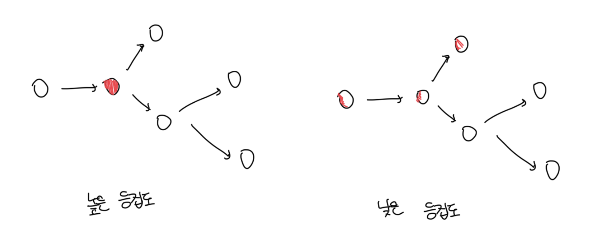
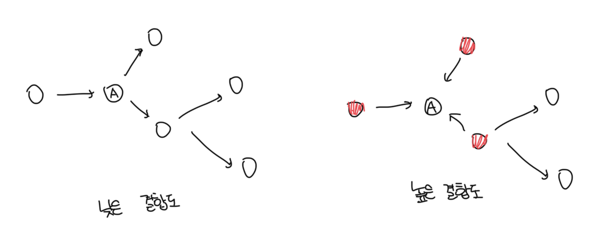

# 캡슐화

- 변경될 가능성이 높은 부분을 `구현`이라고 부르고, 상대적으로 안정적인 부분을 `인터페이스`라고 부름
- 객체를 설계하기 위한 가장 기본적인 아이디어는 변경의 정도에 따라 구현과 인터페이스를 분리하고 외부에서는 인터페이스에만 의존하게 관계를 조절하는것임
- 객체지향의 가장 중요한 원리는 불안정한 구현 세부사항을 안정적인 인터페이스 뒤로 캡술화 하는것임

 

### 추상화와 캡슐화

- 복잡성을 다루기 위한 가장 효과적인 도구는 추상화임
- 캡슐화는 변경 가능성이 높은 부분을 객체 내부로 숨기는 추상화 기법임
- 어떤걸 캡슐화 해야되냐고 묻는다면 변경될 수 있는 어떤것도 캡슐화를 해야함
- 결국 목표는 유지보수성이다. 캡슐화는 좋은 코드로 안내하기 때문에 가장 중요한 제 1원리다

 

# 응집도와 결합도

- 일반적으로 좋은 설계란 `높은 응집도`와 `낮은 결합도`를 가진 설계를 말하며 이는 설계를 변경하기 쉽게 만듬
- 캡슐화를 지킬수록 모듈 안의 응집도는 높아지고, 모듈 사이의 결합도는 낮아짐

 

### 응집도

- 모듈에 포함된 내부 요소들이 연관돼 있는 정도를 나타냄
- 모듈 내의 요소들이 하나의 목적을 위해서 긴밀하게 협력한다면 그 모듈은 높은 응집도를 가짐
- 하나의 변경을 수용하기 위해 모듈 전체가 함께 변경되면 이것은 응집도가 높은것이며 일부만 변경된다면 응집도가 낮은것임
- 응집도가 높을수록 변경의 대상과 범위가 명확해지므로 코드를 변경하기가 쉬워짐

 

### 결합도

- 다른 모듈에 대해서 얼마나 많은 지식을 갖고 있는지를 나타냄
- 결합도는 객체 또는 클래스가 협력에 필요한 적절한 수준의 관계만을 유지하고 있는지를 나타냄
- 결합도가 높으면 높을수록 함께 변경해야 하는 모듈의 수가 늘어나서 변경하기 힘듬
- 내부 구현을 변경했을 때 이것이 다른 모듈에 영향을 미치는 경우 두 모듈 사이 결합도가 높다고 말함

