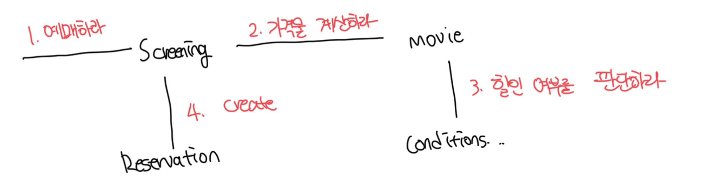

# GRASP 패턴

- `General Responsibility Assignment Software Patterns`의 약자로 일반적인 책임 할당을 위한 소프트웨어 패턴이라고 부른다
- 이는 객체에게 책임을 할당할 때 지침으로 삼을 수 있는 원칙들의 집합을 패턴으로 정리한 것임

 

# 도메인 개념에서 출발하기

- 설계를 시작하기 전에는 도메인에 대한 개략적인 모습을 그려보는게 좋음
- 어떤 책임을 할당해야 할 때 가장 먼저 고민해야 하는 유력한 후보는 바로 도메인 개념임
- 설계를 시작할떄는 개념들의 의미나 관계가 정확하거나 완벽해야할 필요가 없음
- 도메인 개념을 정리하는데 너무 많은 시간을 들이지 말고 빠르게 설계와 구현을 진행하는게 좋음

 

# 올바른 도메인 모델은 존재하지 않는다

- 도메인 모델은 개념적으로 표현한 것이지만 그 안에 포함된 개념과 관계는 구현의 기반이 돼야함
- 이는 도메인 모델이 구현을 염두에 두고 구조화되는 것이 바람직함을 의미함
- 도메인 모델은 계속 바뀌게 되는데 이는 유연성이나 재사용성 등과 같이 실제 코드를 구현하면서 얻게 되는 통착이력으로 도메인에 대한 개념을 바꾸기 때문임

 

# 정보 전문가에게 책임을 할당하기

- 맨 처음 단계는 앱이 제공해야하는 기능을 앱의 책임으로 생각하는것임
- 책임을 앱에 대해 전송된 메세지로 간주하고, 이 메세지를 책임질 첫번째 객체를 선택함

 

### 예시: 영화를 예메한다는 메세지

- 우선 앱에 원하는 메세지는 영화를 예매한다는 것이다
- 여기서 메세지는 `예매해라` 이며 해당 책임을 가질 객체를 정하는게 다음이다
- 객체는 자신의 상태를 스스로 처리하는 자율적인 존재이므로 책임과 책임을 수행하는데 필요한 상태는 동일한 객체 안에 존재해야한다
- 첫번째 원칙은 `책임을 수행할 정보를 알고있는 객체에게 책임 할당하기`라는 원칙으로 GRASP에서는 이를 `정보 전문가 패턴`이라고 부른다

 

### 정보 전문가 패턴 오해

- 해당 패턴은 객체가 자신이 소유하고 있는 정보와 관련된 작업을 수행한다는 일반적인 직관을 표현한 것이다
- 하지만 정보와 데이터는 다르며, 책임을 수행하는 객체가 정보를 `알고`있다고 해서 그 정보를 `저장`할 필요는 없다

 

### 정보 전문가 패턴으로 책임 할당하기

- 아마 `상영`이라는 도메인이 제일 적합할 것이다
- 상영은 영화에 대한 정보, 상영시간, 순번처럼 예매에 필요한 다양한 정보를 가진다
- 이제 예매를 위한 가격을 알아야 하는데 이는 `상영`도메인에서 판단이 불가능하므로 외부에 도움을 요청해야한다

 

### 가격을 계산하는 영화 도메인

- 영화는 스스로 할인 가능한지 판단하고, 해당 정책에 따라서 할인된 금액을 계산한다
- 할인 조건에 따라서 영화의 할인가능 여부는 스스로 판단이 불가능하기에 외부 객체에 도움을 요청한다

 

### 할인 조건 도메인

- `DiscountCondition`은 자체적으로 할인 여부를 판단하는데 필요한 모든 정보를 가지고있다
- `Movie` --(할인금액줘)>> `DiscountCondition` 메세지 전송이후에는 직접 처리하고 판단한다

 

# 높은 응집도와 낮은 결합도

- 설계는 트레이드오프의 활동이며 동일한 기능을 구현할 수 있는 무수한 설계가 존재한다
- 앞서 할인금액 계산을 위해서 `Movie` -> `DiscountCondition`이 아닌 `Screening` -> `DiscountCondition`으로 할 수도 있다
- 전자를 선택한 이유는 결합도와 응집도에 관련이 있다
- N개의 협력 패턴에서 `높은 응집도`와 `낮은 결합도`를 얻을 수 있다면 그 설계를 선택애햐한다
- GRASP에서는 이를 `낮은 결합도 패턴`과 `높은 응집도 패턴`이라고 부른다

 

### 낮은 결합도(Low Coupling) 패턴

- 낮은 결합도는 모든 설계 결정에서 염두에 둬야 하는 원리다
- 위 구조에서 만약 `Screening` -> `DiscountCondition`으로 할 경우 `Screening`이 `DiscountCondition`에 의존하게 되는데 이는 새로운 의존성이 발생한다

 

### 높은 응집도(High Cohesion) 패턴

- 높은 응집도도 역시나 모든 설계 결정에서 염두해야할 원리다
- N개의 설계중에서 하나를 골라야 한다면 높은 응집도를 선택해야한다
- 만약 `Screening -> DiscountCondition`으로 할 경우 `Screening`은 상영에 대한 책임을 가지지만 요금계산에 대한 책임도 떠앉게된다

 

# 창조자에게 객체 생성 책임을 할당하라

- 영화 예매의 최종 결과물은 `Reservation(예약) 인스턴스`이다
- 결국 협력에 참여하는 어떤 객체에게는 `Reservation` 인스턴스를 생성하는 책임이 있어야한다
- `창조자(Creator) 패턴`은 이 같은 경우 사용할 수 있는 `책임 할당 패턴`으로써 객체를 생성할 책임을 어떤 객체에게 할당할지에 대한 지침을 제공한다

 

### Creator 패턴

- `객체 A`를 생성해야 할 때 어떤 객체에게 이러한 책임을 할당할지는 아래 조건을 최대한 만족하는 B에게 책임을 할당한다
  - B가 A를 포함하거나 참조한다
  - B가 A를 기록한다
  - B가 A를 긴밀하게 사용한다
  - B가 A를 초기화하는데 필요한 데이터를 가지고 있다(B는 A에 대한 정보전문가이다)
- 결과적으로 Creator 패턴은 이미 존재하는 객체 사이의 관계를 이용하기 때문에 설계가 낮은 결합도를 유지할 수 있게 해줌

 

### 기존 구조에서 Creator 패턴 적용하기

- 위 조건을 만족하는 객체는 바로 `Screening`이다
- 예매 정보를 생성하는데 필요한 영화, 시간, 순번 등 의 정보에 대한 전문가다
- 예매 요금을 계산하는데 필수적인 `Movie`도 가진다

