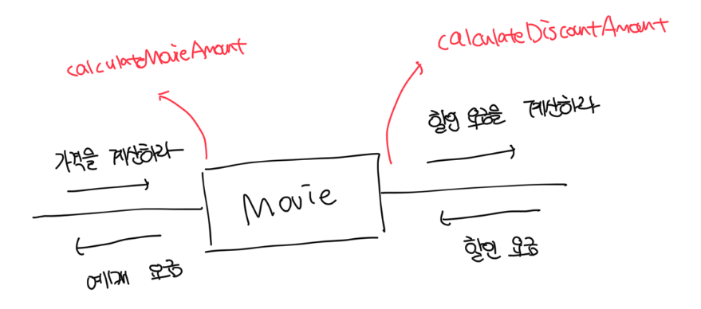
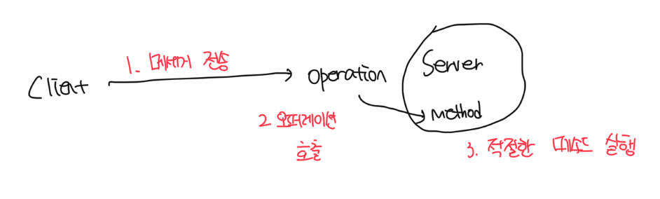

# 객체지향에 대한 오해들

- 클래스는 단지 도구일 뿐 훌룡한 객체지향 코드를 얻기 위해서는 클래스가 아닌 객체를 지향해야 한다
- 좀 더 정확하게 말하면 협력 안에서 객체가 수행하는 책임에 초점을 맞춰야한다
- 가장 중요한 재료는 클래스가 아니라 객체들이 주고받는 메세지다
- 메세지를 퍼블릭 인터페이스인데 단순하게 책임 주도 설계를 한다고해서 좋은 인터페이스를 얻기란 쉽지 않다
- 유연하고 재사용 가능한 퍼블릭 인터페이스를 만드는 데 도움이 되는 설계 원칙과 기법을 익히고 적용해야한다

 

# 클라이언트 - 서버 모델

- 객체지향에서 객체가 다른 객체에게 접근할 수 있는 유일한 방법은 메세지를 전송하는 것뿐이다
- 협력 안에서 메세지를 전송하는 객체를 `클라이언트`라고 부르며, 메세지를 수신하는 객체를 `서버`라고 부른다
- 일반적으로 객체는 협력에 참여하는 동안 `클라이언트`와 `서버`의 역할을 2개다 수행한다
- 협력에 적잡한 객체를 설계하기 위해서는 외부에 전송하는 메세지의 집합도 함께 고려하는것이 바람직하다

 

# 메세지와 메세지 전송

- 한 객체다 다른 객체에서 도움을 요청하는 것을 `메세지 전송` 또는 `메세지 패싱`이라고 부른다
- 메세지를 전송하는 객체를 `메세지 전송자`라고 부르며, 메세지를 수신하는 객체를 `메세지 수신자`라고 부른다
- 메세지는 `오퍼레이션 명`과 `인자`로 구성되며 메세지 전송은 여기에 `메세지 수신자`를 추가한것이다
  - `Screening` -> `Movie`의 경우는 `caluelateMovieAmount(screening)`이 메세지고 `this.movie`가 수신자다

 

# 메세지와 메소드

- 객체가 메세지를 수신했을 때 실제로 어떤 코드가 실행될지는 메세지 수신자의 실제 타입이 무엇인가에 달려있다
- `DiscountCondition`의 경우는 다형성으로 `AmountDiscountCondition`과 `PercentDiscountCondition`으로 나눠진다
- 메세지를 수신했을 떄 실제로 실행되ㅑ는 함수나 프로시저를 `메소드`라고 부른다
- 일반적인 코드에서는 코드의 의미가 컴파일과 런타임 시점에 동일한데 객체지향에선 서로 다르다
- 메세지 전송자는 어떤 메세지를 전송할지만 알면되고 수신자의 경우는 메세지를 처리하기 위해서 어떤 메소드를 사용할지 스스로 결정이 가능하다

 

# 퍼블릭 인터페이스와 오퍼레이션

- 객체가 의사소통을 위해서 외부에 공개하는 메세지의 집합을 퍼블릭 인터페이스라고 부른다
- 프로그래밍 언어의 관점에서는 퍼블릭 인터페이스에 포함된 메세지를 `오퍼레이션`이라고 부르는데 이는 `수행 가능한 어떤 행동에 대한 추상화`다
  - `DiscountCondition`에 정의된 퍼블릭 인터페이스인 `isSatisfiedBy`가 오퍼레이션이라고 할 수 있다
- 따라서 퍼블릭 인터페이스와 메세지 관점에서 보면 `메소드 호출` 보다는 `오퍼레이션 호출`이라는 용어가 더 적절하다

 

# 시그니처

- 오퍼레이션의 이름과 파라미터 목록을 합쳐서 `시그니처`라고 부른다
- 오퍼레이션은 실행 코드 없이 시그치너만을 정의한 것이며, 여기에 구현을 더한것을 메소드라고 부른다
- 객체의 품질은 퍼블릭 인터페이스가 정의하기 때문에, 결국 메세지가 객체의 품질을 정한다고 볼 수 있다
