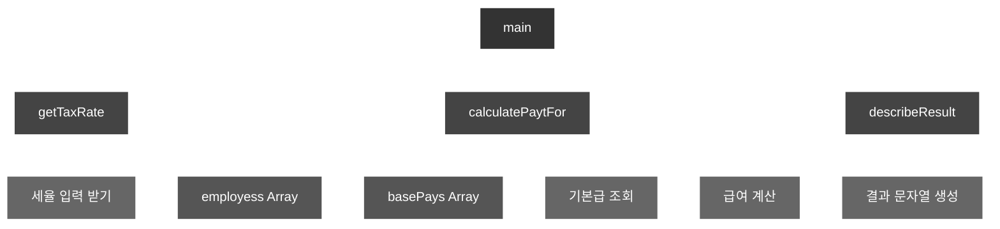

# 메인 함수로써의 시스템

- 기능 분해의 관점에서 추상화의 단위는 프로시저이며, 시스템은 프로시저를 단위로 분해된다
- 프로시저는 반복적이거나 거의 유사하게 실행되는 작업들을 하나의 장소에 모아두어 로직을 사용하고 중복을 방지하는 추상화 방법이다
- 프로시저는 잠재적으로 `정보은닉`의 가능성을 제시하지만, 프로시저만으로 효과적인 정보은닉 체계를 구축하는건 한계가 있다
- 또한 전통적인 기능 분해 방법은 `하양식 접근법`을 따르게 된다

<br>

### 하향식 접근법

- 시스템을 구성하는 가장 `최상위` 기능을 정의하고, 이 최상위 기능을 좀 더 작은 단계의 하위 기능으로 분해하는 방법이다
- 분해는 세분화된 마지막 하위 기능이 프로그래밍 언어로 구현가능한 수준까지 계속된다

<br>

# 급여 관리 시스템

- 기능 분해 방법을 이용해서 급여 관리 시스템을 구축한다
- 최상위 기능으로는 `직원의 급여를 계산한다` 라는 기능이 존재하고, 이 기능으로 시스템을 시작하는 메인 프로시저로 구현될것이다
- 실제로 지급받는 급여를 계산하기 위해서는 `급여 = 기본급 - (기본급 * 소득세율)` 공식이 적용된다

<br>

### 구체화 된 급여계산 절차

- 아래처럼 분할을 시작한다
- 이 때 조금 더 구체화가 가능한 문장들이 남아있는지 검토가 필요하다
- 만약 존재한다면 동일한 과정을 거쳐서 구현이 가능할 정도로 충분히 저수준의 문장이 될 때까지 기능 분해가 필요하다
- 기능 분해 방법에서는 기능을 중심으로 필요한 데이터를 결정하는데, 주연은 기능이며 데이터는 기능을 보조하는 조연의 역할에 머무른다

```
직원이 급여를 계산한다
  사용자로부터 소득세율을 입력받는다
  직원의 급여를 계산한다
  양식에 맞게 결과를 출력한다


직원이 급여를 계산한다
  사용자로부터 소득세율을 입력받는다
    "세율을 입력하세요 :" 라는 문장을 화면에 출력한다
    키보드를 통해서 세율을 입력받는다
  직원의 급여를 계산한다
    전역 변수에 저장된 직원의 기본급 정보를 얻는다
    급여를 계산한다
  양식에 맞게 결과를 출력한다
    "이름: {직원명}, 급여: {금액}" 형식에 따라서 출력 문자열을 생성한다
```

<br>

# 급여 관리 시스템 구현

### 1차 구현

```ts
/**
 * 직원이 급여를 계산한다
 *  사용자로부터 소득세율을 입력받는다
 *  직원의 급여를 계산한다
 *  양식에 맞게 결과를 출력한다
 */
export const main = (name: string) => {
  const taxRate = getTaxRate();
  const pay = calculatePaytFor(name, taxRate);
  console.log(describeResult(name, pay));
};
```

<br>

### 2. 소득 세율 입력받기 구현

```ts
/**
 * 사용자로부터 소득세율을 입력받는다
 *   "세율을 입력하세요 :" 라는 문장을 화면에 출력한다
 *   키보드를 통해서 세율을 입력받는다
 */
const getTaxRate = () => {
  console.log("세율을 입력하세요 :");
  return 0.1;
};
```

<br>

### 3. 직원의 급여 계산 구현

```ts
/**
 * 직원의 급여를 계산한다
 *   전역 변수에 저장된 직원의 기본급 정보를 얻는다
 *   급여를 계산한다
 */
const calculatePaytFor = (name: string, taxRate: number) => {
  return basePays[employess.indexOf(name)] * (1 - taxRate);
};
```

<br>

### 4. 급여 출력 구현

```ts
/**
 * 양식에 맞게 결과를 출력한다
 *    "이름: {직원명}, 급여: {금액}" 형식에 따라서 출력 문자열을 생성한다
 */
const describeResult = (name: string, pay: number) => {
  return `이름: ${name}, 급여: ${pay}`;
};
```

<br>

### 하향식 분해 시스템은 트리다

- 이 처럼 하향식 기능 분해는 시스템을 최상위의 가장 추상적인 메인 함수로 정의한다
- 이후에 메인 함수를 구현 가능한 수준까지 세부적인 단계로 분해하는 방법이다
- 메인 함수를 루트로 하는 `트리`로 표현이 가능하고, 각 노드는 시스템을 구성하는 하나의 `프로시저`를 의미한다



<br>

# 하향식 기능 분해의 문제점

- 하향식 기능 분해로 설계를 진행하면 다양한 문제점이 발생한다
  - 시스템은 하나의 메인 함수로 구성되지 않는다
  - 비즈니스 로직이 UI와 강하게 결헙되고 기능 추가나 요구사항 변경으로 메인 함수 수정이 빈번하게 발생한다
  - ...
- 설계는 코드 배치 방법이고 설계가 필요한 이유는 변경에 대비하기 위함이다
- 변경은 성공적인 소프트웨어가 맞이하는 피할 수 없는 운명이고 소프트웨어는 항상 변경된다

<br>

### 하나의 메인 함수라는 비현실적인 아이디어

- 대부분의 시스템에서는 하나의 메인 기능이란게 존재하지 않는다
- 하향식 접근법은 하나의 알고리즘을 구현하거나 배치 처리를 구현하기에는 적합하지만 현대적인 상호작용 시스템에는 부적합하다

<br>

### 메인 함수의 빈번한 재설계

- 시스템 내부에는 여러개의 정상이 존재하기에 하향식 접근 방법은 기능이 추가될 떄 마다 메인함수 변경이 필요하다
- 기존 코드를 수정하는 것은 항상 새로운 버그를 만들어낼 확률을 높인다는 점에 주의해야한다

<br>

### 비즈니스 로직과 사용자 인터페이스의 결합

- 사용자의 인터페이스는 시스템에서 가장 자주 변경되는 부분이지만 시스템 로직은 이에 비해서 적게 변경된다
- 하지만 하향식 접근 방법은 사용자 인터페이스와 강하게 결합되어 둘이 동시에 변경되게되는데, 이는 기본적으로 변경에 불안정한 아키텍쳐가된다
- 이로써 `관심사의 분리`라는 아키텍쳐 설계의 목적을 달성하기가 어려워진다

<br>

### 성급하게 결정된 실행순서

- 하향식 접근 방법은 큰 함수를 더 작은 함수로 계속 반복하게 되는데 이는 시스템이 `무엇`을 해야할지가 아닌 `어떻게` 동작할지에 집중하게 만든다
- 처음부터 구현을 염두해서 자연스럽게 함수들의 실행 순서를 정의하는 `시간 제약`을 강조한다
- 실행 순서나 조건, 반복 같은 미리 결정하지 않고는 분해를 진행할 수 없기 때문에 `중앙집중 제어 스타일`의 형태를 띌 수 밖에 없다
- 또한 함수 사용도 힘든데, 모든 함수는 상위 함수를 분해하는 과정에서 필요에 따라 식별되고, 상위 함수가 강요하는 `문맥`에서만 의미를 가진다
- 모든 문제의 원인은 결합도로 함수는 상위 함수가 강요하는 문맥에 강하게 결합된다. 이는 시스템을 취약하고 이해하기 어렵게 만든다

<br>

#### 해결방법

- 논리적 제약을 설계의 기준으로 삼는다
- 객체지향처럼 함수 간의 호출 선서가 아닌 객체 사이의 논리적인 관계를 중심으로 설계를 이끌어 나가는것이다

<br>

### 데이터 변경으로 인한 파급효과

- 가장 큰 문제점은 어떤 데이터를 어떤 함수가 사용하고 있는지 추적하기가 힘들다
- 이것은 단순히 코드 안에서 텍스트를 검색하는 문제가 아니고, 의존성과 결합도 문제다
- 데이터 변경으로 인해서 발생하는 함수에 대한 영향도를 파악하는 것은 생각보다 쉽지 않다

<br>

# 언제 하향식 분해가 유용할까

- 하향식은 이미 완전히 이해된 사실을 서술하기에 적합한 방법이다. 새로운 것을 개발하고, 설계하고, 발견하는데는 적합하지 않다
- 작은 프로그램과 개별 알고리즘을 위해서는 유용한 패러다임으로 남아있다
