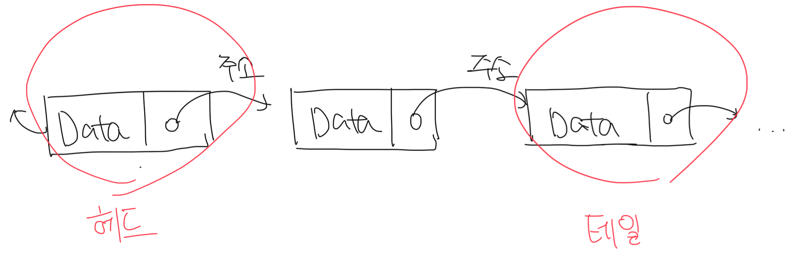

# 링크드 리스트

- 노드를 연결해서 만든 리스트
- 크기를 고정하지 않아도 데이터가 늘어날 때 마다 노드를 만들어서 테일에 붙여주면됨
- 리스트 중간에 데이터를 추가하거나 삭제하는 작업도 매우 쉬움



<br>

# 링크드 리스트 노드 표현

```c
typedef int ElementType;

typedef struct tagNode {
  ElementType Data; // 노드의 데이터(value)
  struct tagNode *NextNode; // 다음 노드를 가르키는 포인터
} Node;

int main() { Node MyNode; }
```

<br/>

# 링크드 리스트의 주요 연산

### 노드 생성/소멸 연산

- `SSL_CreateNode` 함수는 지역 변수를 자동 메모리(스택)에 생성하고 NewData의 필드를 초기화함
- MyNode 포인터는 NewNode가 존재하는 메모리의 주소를 가지지 않음
  - 자동 메모리에 의해서 제거된 NewNode가 존재했던 메모리의 주소를 담음
- 이로써 자동메모리는 노드생성에 적합하지 않음. 남은건 자유 저장소뿐임

```c
typedef int ElementType;

typedef struct tagNode {
  ElementType Data;
  struct tagNode *NextNode;
} Node;

Node *SSL_CreateNode(ElementType NewData) {
  Node NewNode; // 자동 메모리 영역에 새로운 노드 생성
  NewNode.Data = NewData;
  NewNode.NextNode = NULL;

  return &NewNode; // NewNode가 생성된 메모리의 주소를 반환
} // 함수가 종료되면서 NewNode는 자동으로 메모리에서 제거됨

Node *MyNode = SLL_CreateNode(117); // 할당되지 않는 메모리를 가르키게됨
```
