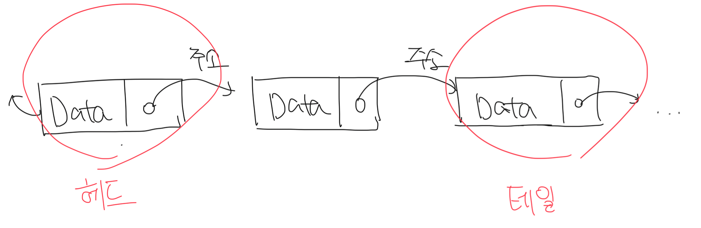

# 링크드 리스트

- 노드를 연결해서 만든 리스트
- 크기를 고정하지 않아도 데이터가 늘어날 때 마다 노드를 만들어서 테일에 붙여주면됨
- 리스트 중간에 데이터를 추가하거나 삭제하는 작업도 매우 쉬움



<br>

# 링크드 리스트 노드 표현

```c
typedef int ElementType;

typedef struct tagNode {
  ElementType Data; // 노드의 데이터(value)
  struct tagNode *NextNode; // 다음 노드를 가르키는 포인터
} Node;

int main() { Node MyNode; }
```

<br/>

# 링크드 리스트의 주요 연산

### 노드 생성 연산

- `SSL_CreateNode` 함수는 지역 변수를 자동 메모리(스택)에 생성하고 NewData의 필드를 초기화함
- MyNode 포인터는 NewNode가 존재하는 메모리의 주소를 가지지 않음
  - 자동 메모리에 의해서 제거된 NewNode가 존재했던 메모리의 주소를 담음
  - 이로써 자동메모리는 노드생성에 적합하지 않음. 남은건 자유 저장소뿐임
- 자유 저장소는 `malloc()` 함수를 통해서 사용이 가능함

#### 메모리 문제가 발생하는 버전

```c
typedef int ElementType;

typedef struct tagNode {
  ElementType Data;
  struct tagNode *NextNode;
} Node;

Node *SSL_CreateNode(ElementType NewData) {
  Node NewNode; // 자동 메모리 영역에 새로운 노드 생성
  NewNode.Data = NewData;
  NewNode.NextNode = NULL;

  return &NewNode; // NewNode가 생성된 메모리의 주소를 반환
} // 함수가 종료되면서 NewNode는 자동으로 메모리에서 제거됨

Node *MyNode = SLL_CreateNode(117); // 할당되지 않는 메모리를 가르키게됨
```

<br>

#### 자유저장소를 활용한 메모리 문제 해결버전

```c
Node *SSL_CreateNode(ElementType NewData) {
  Node *NewNode = (Node *)malloc(sizeof(Node));
  NewNode->Data = NewData; // 데이터 저장
  NewNode->NextNode = NULL; // 다음 노드에 대한 포인터를 NULL로 저장

  return NewNode;
}
```

<br>

### 노드 소멸 연산

- `free()` 함수를 사용해서 메모리 해제가 가능함

```c
void SSL_DestroyNode(Node *_Node) { free(_Node); }
```

<br>

### 노드 추가 연산


```c
void SSL_AppendNode(Node **Head, Node *NewNode) {
  // 헤드 노드가 없다면 새로운 노드가 헤드로 승격함
  if ((*Head) == NULL) {
    *Head = NewNode;
  } else {
    Node *Tail = (*Head);
    while (Tail->NextNode != NULL) {
      Tail = Tail->NextNode;
    }

    Tail->NextNode = NewNode;
  }
}
```

<br>

### 구성한 함수 사용하기 (노드 추가 및 삭제)

```c
int main() {
  Node *List = NULL;
  Node *NewNode = NULL;
  SLL_AppendNode(&List, SLL_CreateNode(117));
  SLL_AppendNode(&List, SLL_CreateNode(119));

  return 0;
}
```

<br>

### 노드 탐색 연산

- 배열의 경우는 특정 인덱스로 O(1)로 바로 접근이 가능하지만, 링크드 리스트의 경우는 노드의 개수만큼 탐색이 필요함
- 원하는 위치의 데이터를 조회하기 위해서는 N-1개의 노드를 거쳐야함


```c
Node *SLL_GetNodeAt(Node *Head, int Location) {
  Node *Current = Head;

  while (Current != NULL && (--Location) >= 0) {
    Current = Current->NextNode;
  }

  return Current;
}


int main() {
  Node *List = NULL;
  Node *NewNode = NULL;
  SLL_AppendNode(&List, SLL_CreateNode(117));
  SLL_AppendNode(&List, SLL_CreateNode(119));

  printf("%d\n", SLL_GetNodeAt(List, 0)->Data); // 117
  printf("%d", SLL_GetNodeAt(List, 1)->Data); // 119

  return 0;
}
```

<br>

### 노드 삭제 연산

- 삭제하고자 하는 노드를 찾고, 해당 노드의 다음 노드를 이전 노드의 NextNode 포인터에 연결


```c
void SLL_RemoveNode(Node **Head, Node *Remove) {
  if (*Head == Remove) {
    *Head = Remove->NextNode;
  } else {
    Node *Current = *Head;
    while (Current != NULL && Current->NextNode != Remove) {
      Current = Current->NextNode;
    }

    if (Current != NULL) {
      Current->NextNode = Remove->NextNode;
    }
  }
}

int main() {
  Node *List = NULL;
  Node *MyNode = NULL;

  SLL_AppendNode(&List, SLL_CreateNode(117));
  SLL_AppendNode(&List, SLL_CreateNode(119));
  SLL_AppendNode(&List, SLL_CreateNode(121));

  // 2번째 노드를 삭제하기 위해서 MyNode에 할당
  MyNode = SLL_GetNodeAt(List, 1);
  printf("%d\n", MyNode->Data); // 119

  // 2번째 노드 삭제
  SLL_RemoveNode(&List, MyNode);

  // 링크드 리스트에서 제거한 노드를 메모리에서 완전히 제거
  SLL_DestroyNode(MyNode);

  MyNode = SLL_GetNodeAt(List, 1);
  printf("%d", MyNode->Data); // 121

  return 0;
}
```

<br>

### 노드 삽입 연산

- 노드와 노드 사이에 새로운 노드를 끼워넣는 연산


```c
void SLL_InsertAfter(Node *Current, Node *NewNode) {
  NewNode->NextNode = Current->NextNode;
  Current->NextNode = NewNode;
}

int main() {
  Node *List = NULL;
  Node *NewNode = NULL;

  SLL_AppendNode(&List, SLL_CreateNode(117));
  SLL_AppendNode(&List, SLL_CreateNode(121));

  Node *Current = List;
  SLL_InsertAfter(Current, SLL_CreateNode(119));

  printf("%d", SLL_GetNodeAt(List, 1)->Data); // 119

  return 0;
}
```

<br>

### 노드 개수 세기 연산

```c
int SLL_GetNodeCount(Node *head) {
  int count = 0;
  Node *current = head;

  while (current != NULL) {
    current = current->NextNode;
    count++;
  }

  return count;
}

int main() {
  Node *List = NULL;
  Node *NewNode = NULL;

  SLL_AppendNode(&List, SLL_CreateNode(117));
  SLL_AppendNode(&List, SLL_CreateNode(121));

  printf("%d", SLL_GetNodeCount(List)); // 2

  return 0;
}
```

<br>

# 링크드 리스트의 장/단점

### 장점

- 새로운 노드의 추가, 삽입, 삭제가 빠르고 쉬움
  - 배열은 중간에 추가하면 데이터가 하나씩 밀려야되서 어려움
- 현재 노드의 다음 노드를 가져오는 연산은 비용이 발생하지 않음

### 단점

- 각 노드는 다음 노드의 주소를 가져야 하므로 4~8 바이트의 추가 공간이 필요함
- 특정 위치에 접근하기 위해서는 N-1 번의 노드 탐색 루프가 필요함
  - 이에 비해 배열은 O(1)로 접근이 매우 빠름
