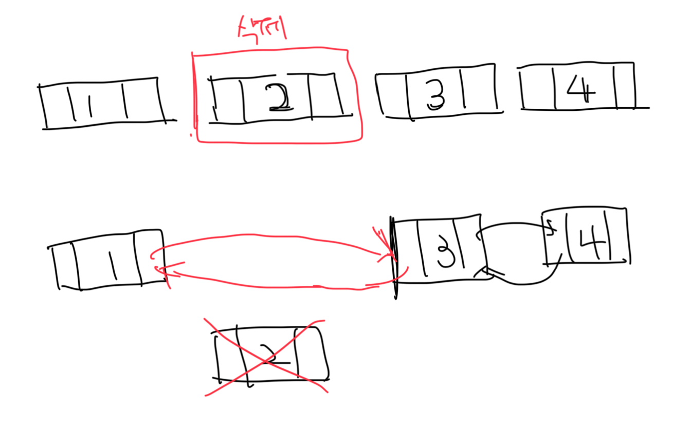
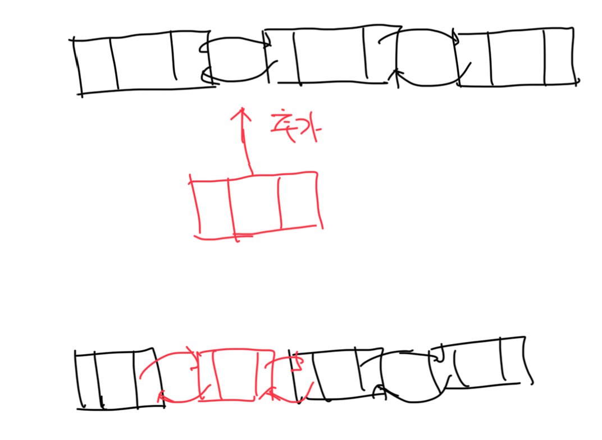

# 더블 링크드 리스트

- 링크드 리스트의 탐색 기능을 개선한 자료구조
- 양방향 탐색이 가능함

```c
typedef int ElementType;

typedef struct tagNode {
  ElementType data;
  struct tagNode *prevNode;
  struct tagNode *nextNode;
} Node;
```


<br>

# 더블 링크드 리스트의 주요 연산

### 노드 생성

```c
Node *DLL_CreateNode(ElementType newData) {
  Node *newNode = (Node *)malloc(sizeof(Node));
  newNode->data = newData;
  newNode->prevNode = NULL;
  newNode->nextNode = NULL;

  return newNode;
}
```

<br>

### 노드 소멸

```c
void DDL_Destroy(Node *node) { free(node); }
```

<br>

### 노드 추가

- 새로운 데이터가 추가될때는 새로운 노드의 tail이 current를 바라봐야하는 차이점이 존재함


```c
void DDL_AppendNode(Node **head, Node *newNode) {
  if (*head == NULL) {
    *head = newNode;
  } else {
    Node *tail = (*head);

    while (tail->nextNode != NULL) {
      tail = tail->nextNode;
    }

    tail->nextNode = newNode;
    newNode->prevNode = tail;
  }
}
```

<br>

### 노드 탐색 연산

```c
Node *DLL_GetNodeAt(Node *head, int location) {
  Node *current = head;
  while (current != NULL && (--location) >= 0) {
    current = current->nextNode;
  }

  return current;
}
```

<br>

### 노드 삭제 연산

- 삭제할 노드의 양쪽(2개), 이전 노드의 NextNode(1개), 다음 노드의 PrevNode(1개) 총 4개의 포인터 관리가 필요함



```c
void DLL_RemoveNode(Node **head, Node *remove) {
  if (*head == remove) {
    *head = remove->nextNode;
    if (*head != NULL) {
      (*head)->prevNode = NULL;
    }

    remove->prevNode = NULL;
    remove->nextNode = NULL;
  } else {
    Node *temp = remove;

    if (remove->prevNode != NULL) {
      remove->prevNode->nextNode = temp->nextNode;
    }

    if (remove->nextNode != NULL) {
      remove->nextNode->prevNode = temp->prevNode;
    }

    remove->prevNode = NULL;
    remove->nextNode = NULL;
  }
}
```

<br>

### 노드 삽입 연산

- 새로운 노드 삽입시 PrevNode는 이전 노드, NextNode는 다음 노드를 가르킴
- 이전 노드의 NextNode와 다음 노드의 PrevNode 포인터는 새로운 노드를 가르킴



```c
void DLL_InsertAfter(Node *current, Node *newNode) {
  newNode->nextNode = current->nextNode;
  newNode->prevNode = current;

  if (current->nextNode != NULL) {
    current->nextNode->prevNode = newNode;
    current->nextNode = newNode;
  }
}
```

<br>

### 노드 개수 세기

```c
int DLL_GetNodeCount(Node *head) {
  int count = 0;
  Node *current = head;

  while (current != NULL) {
    current = current->nextNode;
    count++;
  }

  return count;
}
```
