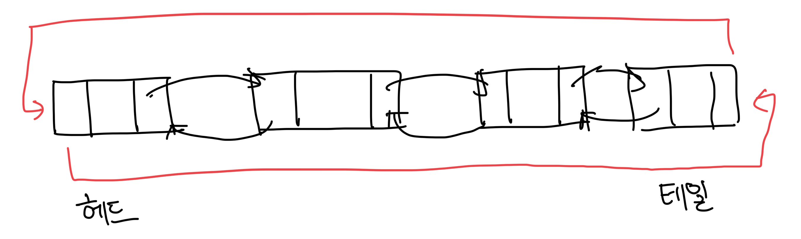
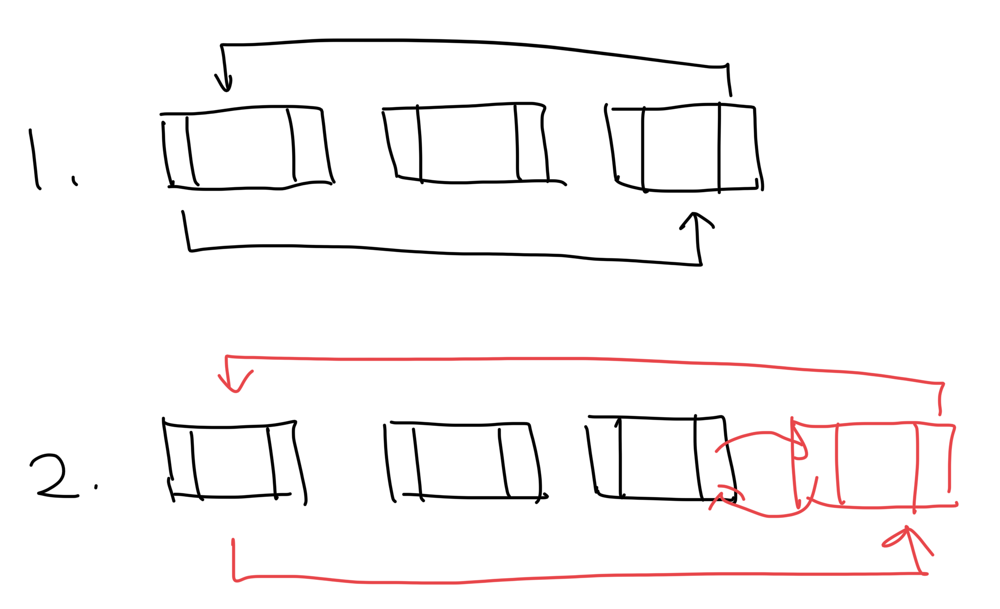
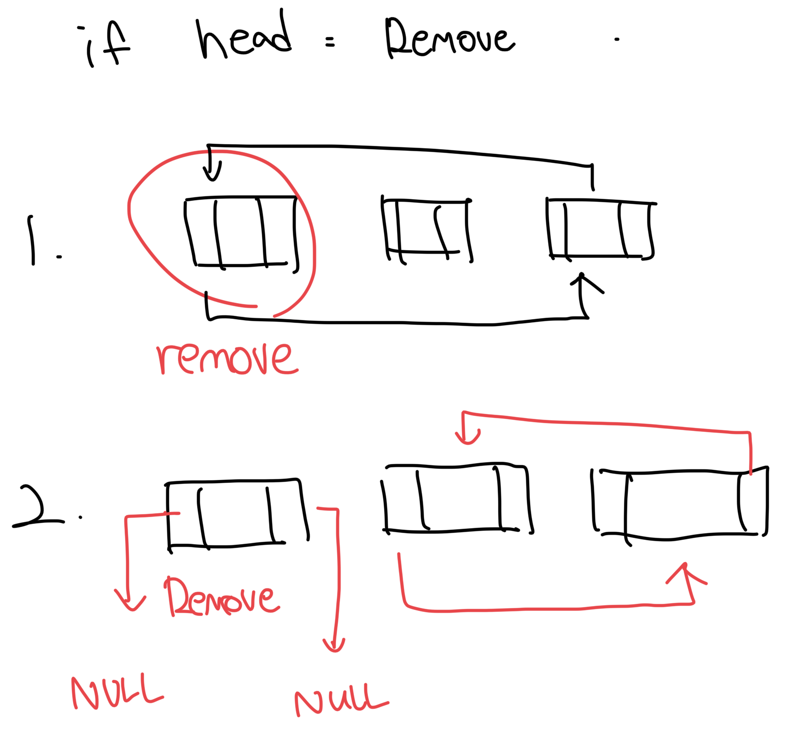
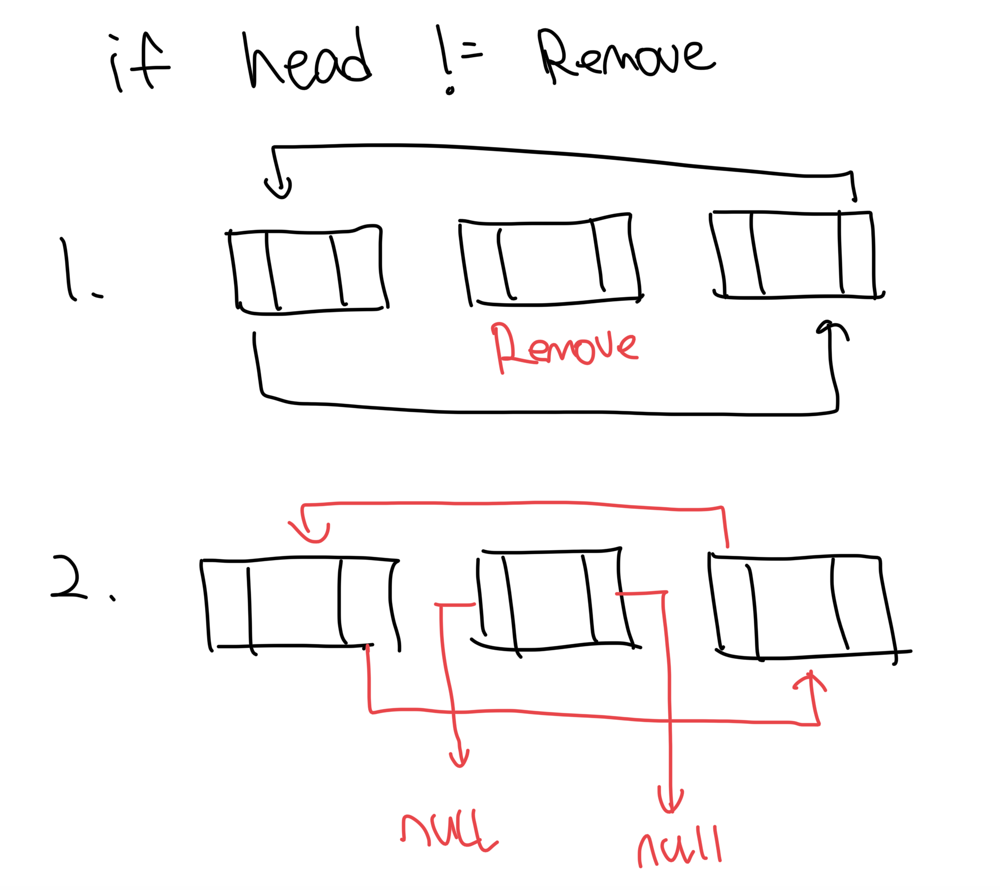

# 환형 링크드 리스트

- 헤드 부분이 테일 부분을 물고있는 형태
- 테일의 다음 노드 포인터가 헤드를 가르키면됨
- 시작을 알면 끝을 알 수 있고, 끝을 알면 시작을 알 수 있음
  - 헤드의 이전 노드 -> 테일, 테일의 다음 노드 -> 헤드 방식



<br>

# 주요 연산

- 환형 더블 링크드 리스트 코드 설계시 2가지를 주의해야함
  - 테일은 헤드의 이전 노드다
  - 헤드는 테일의 다음 노드다

<br>

### 노드 추가 연산

- 새로운 노드가 추가되는건 테일과 헤드 사이에 새 노드를 삽입한다고 생각하면 편함



```c
void CDLL_AppendNode(Node **Head, Node *NewNode)
{
  // 해드 노드가 없다면 새로운 노드가 헤드가됨
  if ((*Head == NULL))
  {
    *Head = NewNode;
    (*Head)->NextNode = *Head;
    (*Head)->PrevNode = *Head;
  }
  else
  {
    // 테일과 헤드 사이에 새로운 노드를 추가함
    Node *Tail = (*Head)->PrevNode;

    Tail->NextNode->PrevNode = NewNode;
    Tail->NextNode = NewNode;

    NewNode->NextNode = *Head;
    NewNode->PrevNode = Tail;
  }
}
```

<br>

### 삭제 연산

- 테일과 헤드가 연결되어 있다는 사실에 주의해야하지만, 큰 차이점은 존재하지 않음




```c
void CDLL_RemoveNode(Node **Head, Node *Remove)
{
  if (*Head == Remove)
  {
    (*Head)->PrevNode->NextNode = Remove->NextNode;
    (*Head)->NextNode->PrevNode = Remove->PrevNode;

    (*Head) = Remove->NextNode;

    Remove->PrevNode = NULL;
    Remove->NextNode = NULL;
  }
  else
  {
    Remove->PrevNode->NextNode = Remove->NextNode;
    Remove->NextNode->PrevNode = Remove->PrevNode;

    Remove->PrevNode = NULL;
    Remove->NextNode = NULL;
  }
}
``
```
