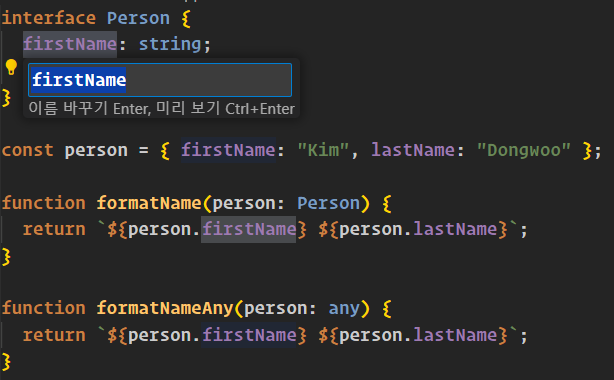

# any 타입 지양하기

- 타입시스템의 특징
  - 점진적(gradual) : 코드에 타입을 조금씩 추가가 가능함
  - 선택적(optional) : 언제든지 타입 체커 비활성화가 가능함

<br/>

1. 아래 코드는 숫자 타입으로 선언된 변수에 문자열을 할당할려고 해서 타입체커에서 에러가 발샐함
2. `as any` 타입단언을 통해서 대입이 가능해짐
3. 하지만 any를 남발하게 되면 안정성이 매우 떨어지고 TS의 수많은 장점을 누릴 수 없음

```ts
let age: number = 0;

// 'string' 형식은 'number' 형식에 할당할 수 없습니다.
age = "12";

age = "12" as any;

age += 1;

console.log(age); // 런타임에는 정상, 하지만 121이 출력됨
```

<br/>

# any는 함수 파라미터의 타입을 무시함

1. TS에서 함수를 작성할때는 파라미터의 타입을 명시해야함
2. 하지만 any 타입을 사용하는 경우는 이런 약속을 어길 수 있음

```ts
function calculateAge(birthDate: Date): number {
  // string 타입에는 getFullYear() 메소드가 존재하지 않으므로 에러가 발생함
  // TypeError: birthDate.getFullYear is not a function
  return new Date().getFullYear() - birthDate.getFullYear();
}

// 문자열이나 any 타입으로 인해 타입체커에서 에러가 발생하지 않음
let birthDate: any = "1999-09-21";
console.log(calculateAge(birthDate));
```

<br/>

# any 타입에는 IDE에서 제공해주는 기능이 적용되지 않음

### 자동완성 기능

기본적으로 TS는 자동완성 기능과 적절한 도움말을 제공해줌


하지만 any 타입을 사용하면 아무런 도움을 받을 수 없음


<br/>

### 심볼 변경 기능

VSCode 기준 타입의 프로퍼티에서 F2를 누르면 심볼을 변경할 수 있음


하지만 any 타입은 심볼을 변경할 수 없음



TS의 모토는 확장 가능한 자바스크립트다. 이러한 이점을 누려야 생산성이 향상된다

<br/>

# any 타입은 코드 리팩토링시 버그를 감춤

1. 어떤 아이템을 선택할 수 있는 웹앱을 만든다고 가정
2. 앱에는 onSelectItem 콜백이 있는 컴포넌트가 존재함
3. 선택하려는 아이템의 타입을 모르니 일단 any를 사용함

```ts
interface ComponentProps {
  onSelectItem: (item: any) => void;
}

function renderSelector(props: ComponentProps) {
  // something..
}

let selectedId = 0;

function handleSelecItem(item: any) {
  selectedId = item.id;
}

renderSelector({ onSelectItem: handleSelecItem });
```

만약 위 코드에서 `onSelecItem` 콜백함수에 아이템 객체를 필요한 부분만 전달하도록 개선하면 아래와 같음

```ts
interface ComponentProps {
  onSelectItem: (id: number) => void;
}
```

타입체커에서 경고는 발생하지 않지만 만약 handleSelecItem에 number 형식의 id가 전달된다면 런타임에 에러가 발생함

<br/>

# any는 타입 설계를 감춰버림

1. 앱의 상태같은 객체의 타입을 정의하는건 매우 복잡함
2. any를 사용해서 간단히 끝내버릴수도 있지만 이는 상태 객체의 설게를 감춰버리므로 절대 하면 안됨
3. 가능하면 설계에 대한 의도가 보이도록 타입을 일일히 작성하는것이 좋음

<br/>

# any는 타입시스템의 신뢰도를 떨어뜨림

1. 사람은 항상 실수를 하고 이러한 실수를 예방하기 위해서 타입 체커가 실수를 잡아두고 코드의 신뢰도가 올라감
2. 하지만 런타임에 에러가 발생하는 경우 타입체커에 대한 신뢰도가 낮아질 수 밖에 없음
3. TS는 개발경험을 높여주기도 하지만 코드 내 수많은 any 타입으로 인해서 더 어려워질수도 있음
