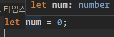
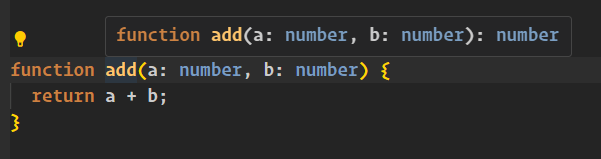
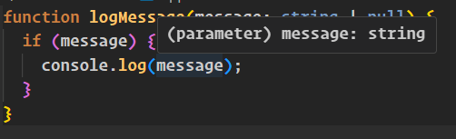
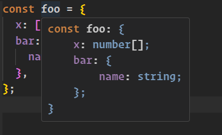
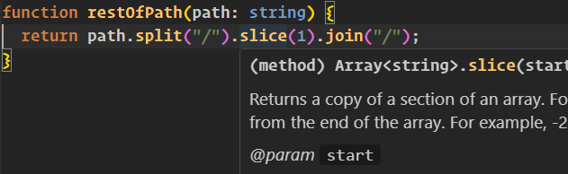
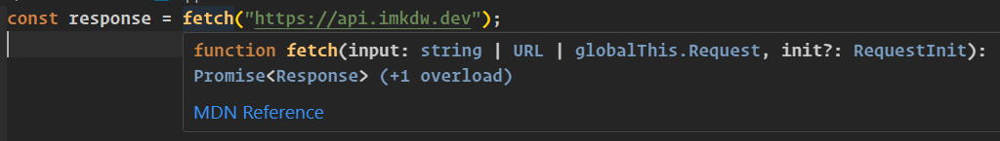
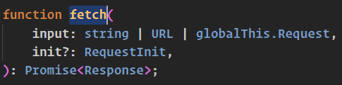

# 타입스크립트의 타입 시스템

TS는 JS로 변환하는데 사용하기도 하지만 제일 핵심은 **타입시스템**이다

</br>

# 편집기를 사용하여 타입 시스템 탐색하기

### 변수의 타입 추론

TS에 의해서 number 타입으로 추론됨

```ts
let num = 0;
```



<br/>

### 함수 반환값의 타입 추론

숫자 + 숫자는 숫자이므로 반환값이 number 타입으로 추론됨

```ts
function add(a: number, b: number) {
  return a + b;
}
```



<br/>

### 조건문의 분기에서 타입 추론 1

함수 파라미터의 타입은 string | null 타입임

```ts
function logMessage(message: string | null) {
  if (message) {
    console.log(message);
  }
}
```

하지만 `if (message)` 조건 내부에서 메세지는 string 으로 추론됨



<br/>

### 객체 내부의 타입 추론

```ts
const foo = {
  x: [1, 2, 3],
  bar: {
    name: "Fred",
  },
};
```



<br/>

### 메소드 체이닝 내부의 타입 추론

```ts
function restOfPath(path: string) {
  return path.split("/").slice(1).join("/");
}
```

`String.split("/")` 의 결과물은 string[]으로 추론되므로 slice는 string[].slice 타입으로 추론됨

위 예시는 짧아서 큰 의미는 없지만 실제 코드에서 함수호출이 길게 이어진다면 디버깅할때 꼭 필요함



<br/>

### 조건문의 분기에서 타입 추론 2

```ts
function getElement(elOrId: string | HTMLElement | null): HTMLElement {
  if (typeof elOrId === "object") {
    // 'HTMLElement | null' 형식은 'HTMLElement' 형식에 할당할 수 없습니다.
    return elOrId;
  } else if (elOrId === null) {
    return document.body;
  } else {
    // 'HTMLElement | null' 형식은 'HTMLElement' 형식에 할당할 수 없습니다.
    return document.getElementById(elOrId);
  }
}
```

- `typeof null` 은 `object` 이므로 첫번째 if 문에서는 HTMLElement 또는 null 타입으로 추론됨
  - 처음 if 문에서 null 여부를 추가로 검증해서 바로잡아야함
- document.getElementById 메소드도 HTMLElement | null 타입으로 추론됨
  - if 문에서 null 여부를 추가로 검증해서 바로잡아야함

```ts
function getElement(elOrId: string | HTMLElement | null): HTMLElement {
  if (!elOrId) {
    return document.body;
  }

  if (typeof elOrId === "object") {
    return elOrId;
  } else {
    const el = document.getElementById(elOrId);
    if (!el) {
      throw new Error(`Element with id ${elOrId} not found`);
    }

    return el;
  }
}
```

<br/>

### IDE에서 타입정의 따라가기

1. 아래는 fetch 코드에 대한 타입 정의를 따라가는 방법 예시임
2. VSCode 기준으로 F12 키를 눌러서 타입 정의로 이동할 수 있음

```ts
const response = fetch("https://api.imkdw.dev");
```




