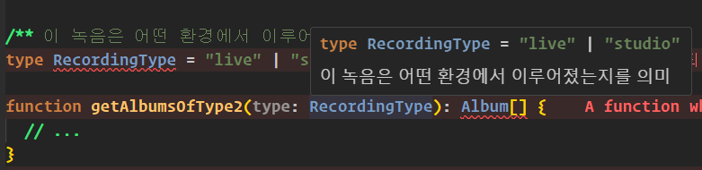

# 유니온의 인터페이스보다 인터페이스 유니온 사용하기

- 유니온 타입을 가지는 인터페이스를 사용중이라면, 인터페이스의 유니온 타입을 사용하는게 더 올바를지 검토해봐야함

### 예시 1

```ts
interface FillLayout {}
interface LineLayout {}
interface PointLayout {}
interface FillPaint {}
interface LinePaint {}
interface PointPaint {}

interface Layer {
  layout: FillLayout | LineLayout | PointLayout;
  paint: FillPaint | LinePaint | PointPaint;
}
```

- 만약 layout이 `FillLayout` 인데 paint가 `LinePaint` 인 타입은 성립되지 않음
- 이런 조합을 허용한다면 오류가 발생하기 십상이고 인터페이스 다루기도 힘듬

<br/>

#### 리팩토링 : 태그된 유니온으로 분리하기

- 단점은 타입 분기 후 layer가 포함된 동일한 코드가 반복되는것이 아쉬움

```ts
interface FillLayout {}
interface LineLayout {}
interface PointLayout {}
interface FillPaint {}
interface LinePaint {}
interface PointPaint {}

interface FillLayer {
  type: "fill";
  layout: FillLayout;
  paint: FillPaint;
}

interface LineLayer {
  type: "line";
  layout: LineLayout;
  paint: LinePaint;
}

interface PointLayer {
  type: "point";
  layout: PointLayout;
  paint: PointPaint;
}

type Layer = FillLayer | LineLayer | PointLayer;

function drawLayer(layer: Layer) {
  if (layer.type === "fill") {
    const { layout, paint } = layer; // FillLayout, FillPaint
  } else if (layer.type === "line") {
    const { layout, paint } = layer; // LineLayout, LinePaint
  } else {
    const { layout, paint } = layer; // PointLayout, PointPaint
  }
}
```

<br/>

### 예시 2

- 타입 내부에 주석이 있다는건 문제가 될 소지가 매우 높음
- 이럴때는 차라리 2개의 속성을 하나의 속성으로 분리하는게 좋음

```ts
interface Person {
  name: string;
  // 둘 다 동시에 있거나 없음
  placeOfBirth?: string;
  dateOfBirth?: Date;
}
```

<br/>

#### 리팩토링 : 2개의 optional 속성 하나로 묶기

- birth가 존재하지만 내부에 필요한 속성이 1개만 있다면 에러가 발생하게됨

```ts
interface Person {
  name: string;
  birth?: {
    place: string;
    date: Date;
  };
}

/**
 * birth 속성 내부에 값이 하나만 있는 경우
 */
const ala: Person = {
  name: "Alan Turing",
  // 'place' 속성이 '{ date: Date; }' 형식에 없지만 '{ place: string; date: Date; }' 형식에서 필수입니다.
  birth: {
    date: new Date("1912-06-23"),
  },
};

/**
 * 타입 체크방법
 */
function eulogize(p: Person) {
  p.name; // string;
  const { birth } = p;
  if (birth) {
    birth.place; // string;
    birth.date; // Date;
  }
}
```

여기서 만약 타입을 직접 수정할 수 없다면 인터페이스 유니온을 활용해서 처리가 가능함

```ts
interface Name {
  name: string;
}

interface PersonWithBirth extends Name {
  placeOfBirth: string;
  dateOfBirth: Date;
}

type Person = Name | PersonWithBirth;

function eulogize(p: Person) {
  p.name; // string;
  if ("placeOfBirth" in p) {
    p.placeOfBirth; // string;
    p.dateOfBirth; // Date;
  }
}
```

<br/>

# 장점들

### 타입을 명시적으로 정의함으로써 다른 곳으로 값이 전달되어도 타입정보가 유지됨

- 만약 string으로 타입을 명시한다면 함수를 호출하는 입장에서 무슨값이 들어와야하는지 알 수 없음

```ts
// 문제
function getAlbumsOfType1(type: string): Album[] {
  // ...
}
getAlbumsOfType1("Kimch"); // 정상

// 개선
function getAlbumsOfType2(type: RecordingType): Album[] {
  // ...
}
getAlbumsOfType2("Kimch"); // '"Kimch"' 형식의 인수는 'RecordingType' 형식의 매개 변수에 할당될 수 없습니다.
```

<br/>

### 타입을 명시적으로 정의하고 해당 타입의 의미를 설명하는 주석 작성이 가능함

- `jsdoc` 방식으로 작성해야 IDE에서 힌트를 보여줌



<br/>

### keyof 연산자로 더욱 세밀하게 객체의 속성 체크가 가능함
