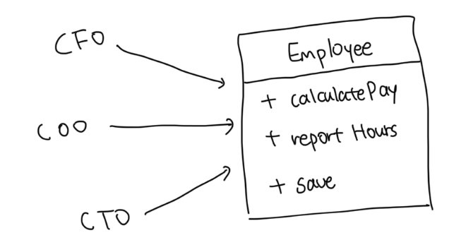
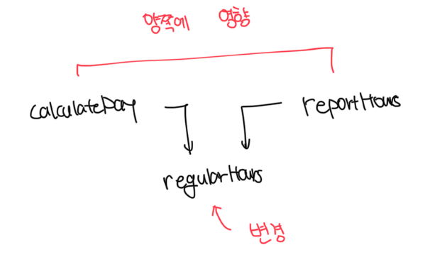
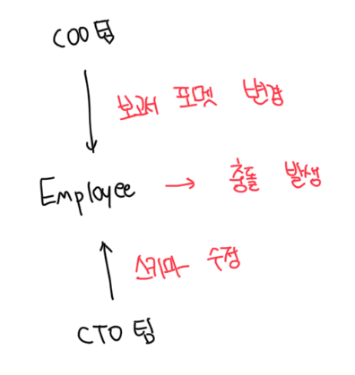
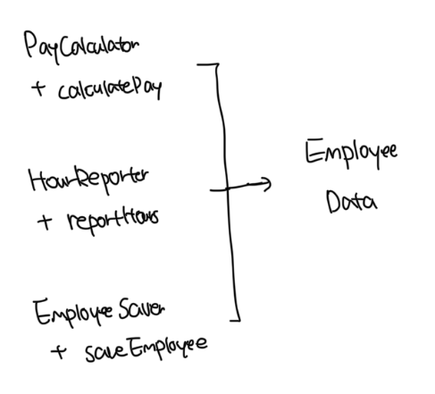
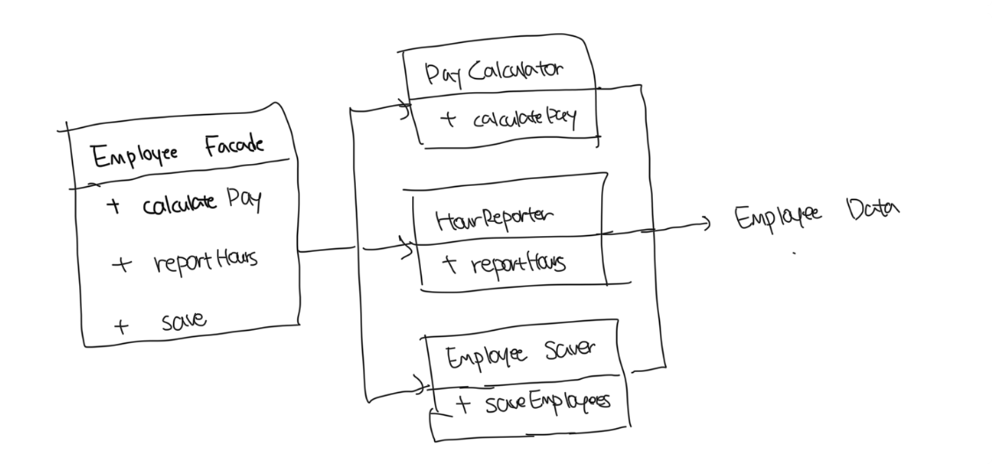
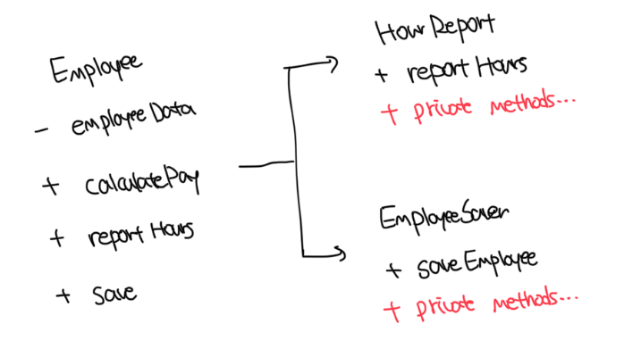

# 단일 책임 원칙

- 하나의 모듈은 하나의, 오직 하나의 액터에 대해서만 책임져야 한다
- 일부 언어와 개발 환경에서는 코드를 소스 파일에 저장하지 않는데, 이런 경우 모듈은 단숨히 함수와 데이터 구조로 구성된 응집된 집합이다
- 단일 액터를 책임지는 코드를 함꼐 묶어주는 힘이 바로 응집성이다

 

# 징후 1 : 우발적 중복

 

### 각 메소드의 기능

- `calculatePay()` : 회계팀에서 기능을 정의, CFO 보고를 위해서 사용
- `reportHours()` : 인사팀에서 기능을 정의하고 사용, COO 보고를 위해 사용
- `save()` : DBA가 기능을 정의하고, CTO 보고를 위해서 사용

 

### 중복되는 상황

- `calculatePay()` 메소드와 `reportHours()`에 초과 근무를 제외한 업무 시간을 계산하는 알고리즘이 필요함
- 개발자는 코드 중복을 피하기 위해서 해당 알고리즘은 `regularHours()` 메소드에 넣었다고 가정
- `CFO(calculatePay)` 팀에서 초과근무 시간 계산을 바꾸고싶어서 알고리즘을 바꾸면 `COO(reportHours)` 팀에도 영향을 미침
- 이러한 문제는 결국 서로 다은 액터가 의존하는 코드를 너무 가까이 배치했기 떄문임

 

# 징후 2 : 병합

### 문제 상황

- CTO 팀은 `Employee`의 스키마를 변경
- COO 팀은 `reportHours()` 보고서의 포멧을 변경
- 서로 같은 코드를 수정해서 충돌 발생

 

### 전략

- 이처럼 충돌은 모두 많은 많은 사람이 서로 다른 목적으로 동일한 소스를 변경하면 발생
- 서로 다른 액터를 뒷밤침하는 코드를 서로 분리하는게 해결책임

 

# 해결법

- 다양한 방법이 있는데, 그 모두가 메서드를 각기 다른 클래스로 이동시키는 방식임
- 가장 확실한 해결책은 데이터와 메서드를 분리하는 방식일 것임

 

### 데이터, 메서드 분리

- 데이터와 메소드를 분리하고, 각 클래스는 자신의 메소드에 반드시 필요한 소스 코드만을 포함
- 각 3개의 클래스는 서로의 존재를 몰라야함
- 단점은 세가지 클래스를 인스턴스화하고 추적해야하는 문제가 있음
  - 이런 문제를 위해서 `Facade 패턴`이 존재함

 

### Facade 패턴

- Facade에 코드는 거의 없고 이 클래스는 3개의 클래스의 객체를 생성하고, 요청된 메소드를 가지는 객체로 위임하는 일을 책임짐

- 일부 개발자는 가장 중요한 업무 규칙을 데이터와 가장 가깝게 배치하는 방식을 선호함
- 가장 중요한 메소드는 기존의 Employee 클래스에 유지하고, Employee 클래스에 덜 중요한 나머지 메소드들에 대한 Facade로 사용할수도 있음
- 하나의 클래스는 단 하나의 메소드를 가져야 한다는 주장에 근거해서 반대할수도 있지만 현실과는 다름
- 각 클래스에는 다양한 기능을 구현하는데 필요한 메소드의 개수는 실제로 훨씬 많음. private 메소드를 다수 포함할것임

 

# 결론

- 단일 책임 원칙은 메소드와 클래스 수준의 원칙이지만 이보다 상위의 두 수준에서도 다른 형태로 또 등장함
- 컴포넌트 수준에서는 공통 폐쇠 원칙이 되고, 아키텍쳐 수준에서는 아키텍쳐 경계의 생성을 책임지는 변경의 축이 됨
