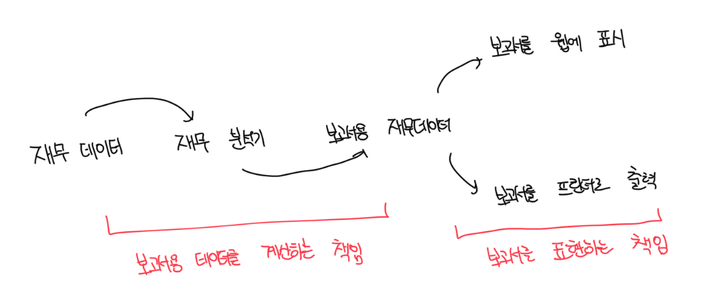
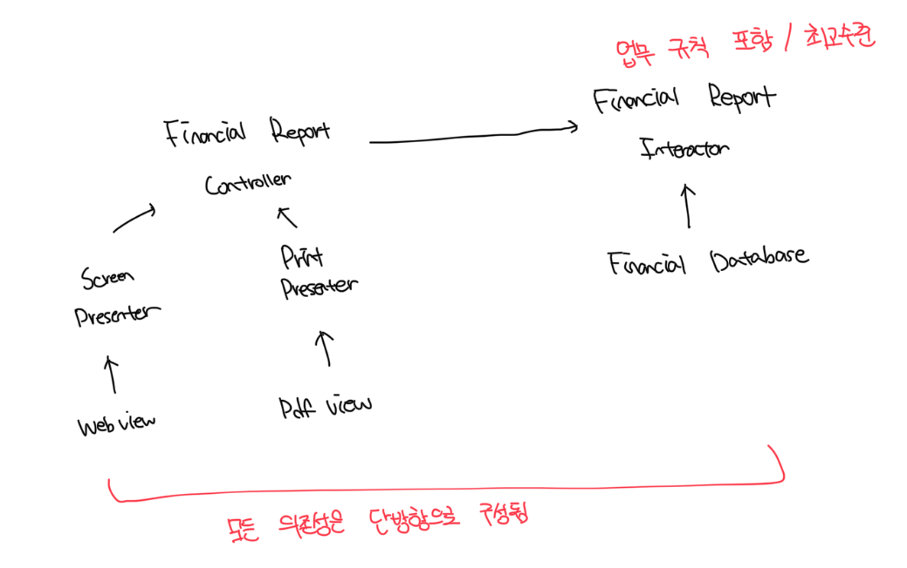

# 개방 폐쇠 원칙

- 소프트웨어 개체(artifact)는 확장에 열려있고, 변경에는 닫혀 있어야 한다
- 즉 개체의 행위는 확장이 가능해야 하지만 개체를 변경해서는 안된다

 

# 사고 실험

### 상황

- 재무재표를 웹 페이지로 보여주는 시스템이 있다고 가정한다
- 만약 동일한 정보를 보고서 형태로 변환하고 흑백으로 출력해달라고 할때 코드가 얼마나 바뀌어야할까?
- 단일책임원칙(SRP)를 적용한 아키텍쳐는 아래와 같다

 

### 구조도

 

# 정보 은닉

- 추이종속성(Transitive dependency)는 `A -> B`, `B -> C` 상태일때 `A -> C` 라는걸 뜻함
- 만약 컨트롤러와 엔티티 사이에 인터페이스가 없었다면 컨트롤러와 엔티티는 추이종속성을 가짐
- 결국 자신이 직접 사용하지 않는 요소에는 절대로 의존해서는 안된다 라는 원칙을 깨트림

 

# 결론

- OCP는 시스템의 아키텍쳐를 떠받치는 원동력 중 하나다
- 시스템을 확장하기 쉬운 동시에 변경으로 인해 시스템이 너무 많은 영향을 받지 않도록 하는데있다
- 시스템을 컴포넌트 단위로 분리하고, 저수준 컴포넌트에서 발생한 변경으로부터 고수준 컴포넌트를 보호할 수 있는 형태의 의존성 계층구조를 만들어야한다
