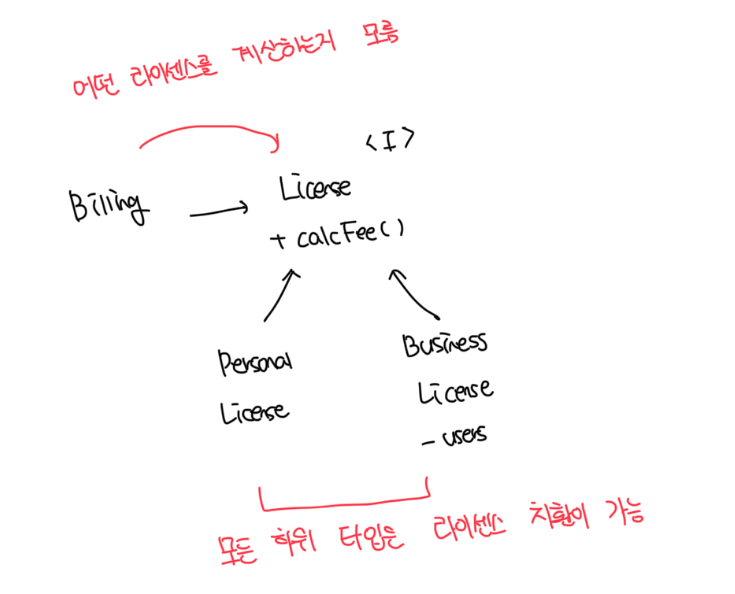
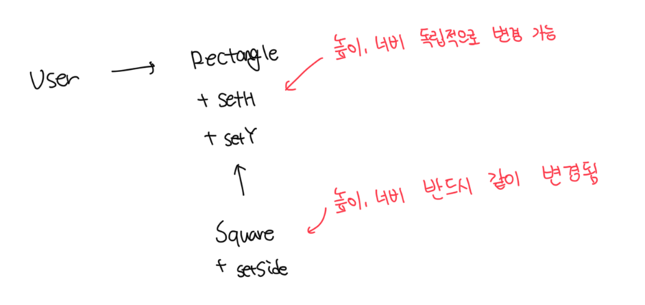

# 상속을 사용하도록 가이드 하기



- 위 예시는 LSP 원칙을 준수함
- `Billing` 입장에서는 `License` 하위 타입 중 어떤걸 쓰는지 전혀 의존하지 않음
- `Personal`, `Business` 하위 타입은 License 타입을 치환할 수 있음

<br>

# 정사각형/직사각형 문제



- 위 구조에서 `User`는 대화하고 있는 상대가 `Rectangle`이라고 생각하므로 혼동이 생길 수 있음
- 이러한 LSP 위반을 막기 위해서는 if 등을 통해 Rectangle이 실제로 Square인지 검사하는 방식으로 해결이 가능함
  - 하지만 User의 행위가 사용하는 타입에 의존하므로 결국 타입을 서로 치환할 수 없음

```ts
const r = new Rectangle();
r.setW(5);
r.setH(10);
assert(r.area() === 50); // 직사각형? 정사각형?
```

<br>

# LSP와 아키텍쳐

- 초기 LSP는 상속을 사용하도록 가이드하는 방법 정도로 간주되었음
- 하지만 이제는 LSP는 인터페이스와 구현체에도 적용되는 더 광범위한 소프트웨어 설계 원칙으로 변모된
- 자바스러운 언어는 인터페이스 하나와 이를 구현하는 여러개의 클래스로 구성됨
- 루비의 경우 동일한 메소드 시그니처를 공유하는 여러개의 클래스로 구성됨

<br>

# 결론

- LSP는 아키텍쳐 수준까지 확장이가능하고, 반드시 확장해야한다
- 치환 가능성을 조금이라도 위배하면 시스템 이키텍처가 오염되어 상당량의 별도 메커니즘을 추가해야될수도 있다
