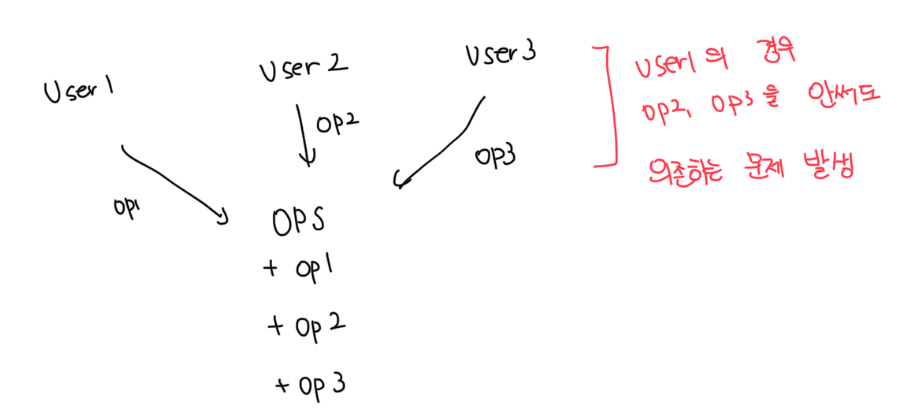
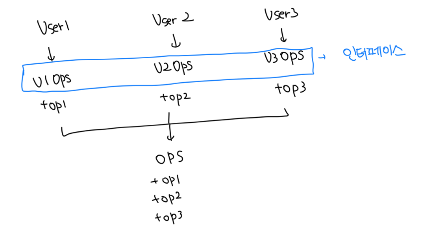

# 불필요한 빌드(정적언어)

### 기존

- `User1`은 `op1`만 사용하는데 구조상 `op2`, `op3`에도 의존하는 상황이 발생함
- 만약 `op2`만 수정한다고 해도 `User1`도 같이 컴파일해서 배포가 필요함

 

### 개선

- 각 유저는 개별 `op`의 인터페이스에 의존함
- `OPS`가 변경되도 `User1`을 다시 컴파일할 필요가 없음

 

# ISP와 언어

- 정적언어 에서는 `import`, `use`, `include`같은 타입 선언을 사용하게 강제함
- 소스코드간 의존성이 발생하고, 재컴파일 또는 재배포가 강제되는 상황이 무조건 발생함
- 루피나 파이썬같은 동적언어의 경우는 이러한 문제가 발생하지 않고 런타임에 추론이 발생함
- 결국 ISP를 아키텍쳐가 아닌 언어와 관련된 문제라고 결론내릴수도 있음

 

# ISP와 아키텍쳐

- 일반적으로 필요 이상의 많은걸 포함하는건 불필요한 재컴파일, 재배포를 유발하므로 해로운 일임
- 만약 `F -> S -> D` 의존성 그래프에서 D 내부가 변경되면 F도 재배포가 필요할수도 있음
- 또한 D에 문제로 인해서 S까지 영향을 끼칠수가 있음

 

# 결론

- 불필요한 짐을 실은 무언가에 의존하면 예상치못한 문제에 빠진다는 점
