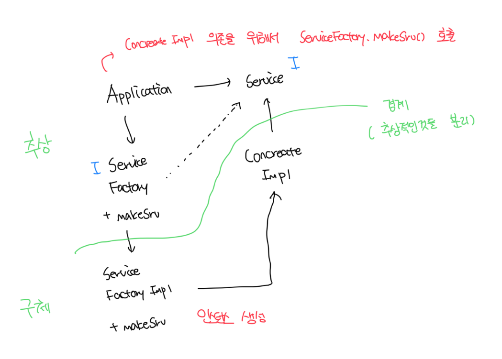

# 유연성이 극대화된 시스템

- 소스코드 의존성이 추상(abstract)에 의존하고, 구체(concretion)에는 의존하지 않는 시스템
- 정적 타입 언어에서 `use`, `import`, `include` 구문은 인터페이스나 추상클래스 같은 추상적인 선언만을 참조
- 절대 구체적인 대상에는 의존하면 안된다
- 예외가 존재하는데 운영체제나 플랫폼 같이 안정서잉 보장된 환경에 대해서는 DIP에 대해서 무시하는 편임

 

# 안정된 추상화

- 구체적인 구현체에 변화가 생기더라도 인터페이스는 구현체보다 변동성이 낮음
- 변동성이 큰 구현체에 의존하는 일은 지양하고, 안정된 추상 인터페이스를 선호하는게 안정된 소프트웨어 아키텍쳐다

 

### 변동성이 큰 구체 클래스 참조하지 말기

- 대신 추상 인터페이스를 참조하자
- 일반적으로 추상 팩토리를 사용하도록 강제한다

 

### 변동성이 큰 구체 클래스로부터 파생하지 말기

- 상속은 소스코드에 존재하는 모든 관계중 가장 강력한 동시에 뻣뻣해서 변경이 힘들다
- 상속은 아주 신중하게 사용하자

 

### 구체 함수를 오버라이드 하지 말자

- 일반적으로 구체함수는 소스 코드 의존성을 필요로함
- 구체 함수를 오버라이드 하게되면 의존성 제거가 불가능하고, 실제로 그 의존성을 상속하게됨
- 이러한 의존성을 제거할려면 차라리 추상 함수로 선언하고 구현체들에서 각자의 용도에 맞게 구현하자

 

# 팩토리

- 변동성이큰 구체적인 객체는 특별히 주의해서 생성해야됨
- 모든 언어는 객체를 생성하러면 해당 객체를 구체적으로 정의한 코드에 대해 소스 코드 의존성이 발생함
- 보통 대다수의 객체 지향 언에서 이처럼 바람직하지 맛혼 의존성을 처리할 때 추상 팩토리를 사용하곤함

 

### 추상 컴포넌트와 구체 컴포넌트

- 추상 컴포넌트는 앱의 모든 고수둔 업무 규칙을 포함한다
- 구체 컴포넌트는 업무 규칙을 다루기 위해 필요한 모든 세부사항을 포함한다
- 제어 흐름은 코드 의존성과 정반대 방향으로 곡선을 가로지른다는 점이 중요하다
- 소스코드 의존성을 제어흐름과는 반대 방향으로 역전되는데 이러한 이유로 이를 `의존성 역전(Dependency Inversion)` 이라고 부름
  - 하지만 모든 DIP 위배를 없앨수는 없다
  - DIP를 위배하는 클래스들은 적은 수의 구체 컴포넌트 내부로 모을 수 있고, 이를 통해 시스템의 나머지 부분과 분리한다
