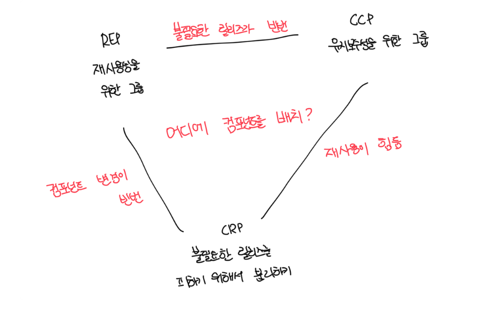

# REP: 재사용/릴리스 등가 원칙

- 재사용의 단위는 릴리스 단위와 동일함
- 단일 컴포넌트는 응집성높은 클래스와 모듈들로 구성되어 있어야한다
- 컴포넌트를 구성하는 모든 모듈은 서로 공유하는 중요한 테마나 목적이 있어야 한다
- 하나의 컴포넌트로 묶인 클래스와 모듈은 반드시 함께 릴리스가 가능해야한다
- 즉 컴포넌트로 묶은 클래스와 모듈은 버전 번호가 같아야 하고, 동일한 릴리스로 추적 관리되고 동일한 릴르수 문서에 포함되야한다

 

# CCP: 공통 폐쇠 원칙

- 단일 컴포넌트는 변경의 이유가 여러 개 있어서는 안 된다고 말한다
- 대부분의 앱에서는 유지보수성은 재사용성 보다 훨씬 중요하다
- 변경될 가능성이 있는 클래스는 모두 한곳으로 묶는걸 권장한다
- CCP는 컴포넌트 수준의 SRP(단일 책임 원칙)이다
- 즉 동일한 시점에 동일한 이유로 변경되는 것들을 한데 묶고, 서로 다른 시점에 다른 이유로 변경되는 것들은 서로 분리해야한다

 

# CRP: 공통 재사용 원칙

- 같이 재사용되는 경향이 있는 클래스와 모듈들은 같은 컴포넌트에 포함해야된다
- CRP는 또한 동일한 컴포넌트로 묶어서는 안되는 클래스가 무엇인지도 말해준다
- 어떤 컴포넌트가 다른 컴포넌트를 사용하면, 두 컴포넌트 사이에는 의존성이 생겨난다
- 의존하는 컴포넌트가 있다면 해당 컴포넌트의 모든 클래스에 대해 의존함을 확실히 인지해야 하는데 이건 한 컴포넌트에 속한 클래스들은 더 작게 그룹지을수 없다는걸 뜻한다
- CRP는 강하게 결합되지 않은 클래스들을 동일한 컴포넌트에 위치시켜서는 안 된다고 말한다

 

# ISP와의 관계

- CRP는 ISP의 포괄적인 버전으로 ISP는 사용하지 않는 메소드가 있는 클래스에는 의존하지 말라고 말한다
- 즉 필요하지 않은 것에 의존하지 말라는 의미다

 

# 컴포넌트 응집도에 대한 균형 다이어그램

- REP, CCP는 포함(inclusive)의 원칙이다. 두 원칙은 컴포넌트를 더욱 크게 만든다
- CRP는 배제(exclusive)의 원칙이다. 해당 원칙은 컴포넌트를 더욱 작게 만든다
- 프로젝트 초기에는 CCP보다 REP가 훨씬 중요한데, 개발 가능성이 재사용성보다 더욱 중요하기 떄문임
- 프로젝트의 컴포넌트 구조는 시간과 성숙도에 따라 변하기 때문에 아키텍트의 역할이 중요함

 

# 결론

- 어느 클래스들을 묶어서 컴포넌트로 만들지 결정할 때, 재사용성과 개발 가능성이라는 상충하는 힘을 반드시 고려해야함
- 시간이 흐름에 따라서 프로젝트의 초점이 개발가능성에서 재사용성으로 바뀌고, 컴포넌트를 구성하는 방식도 흐트러지고 진화함
