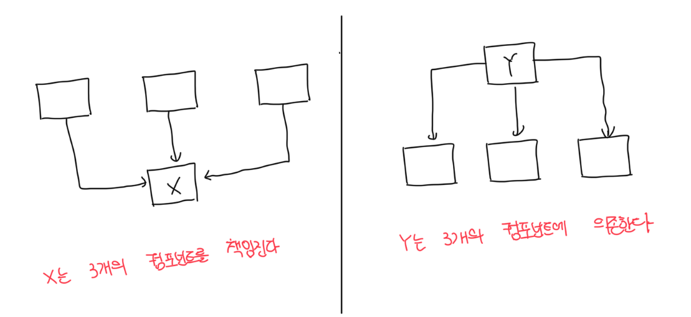
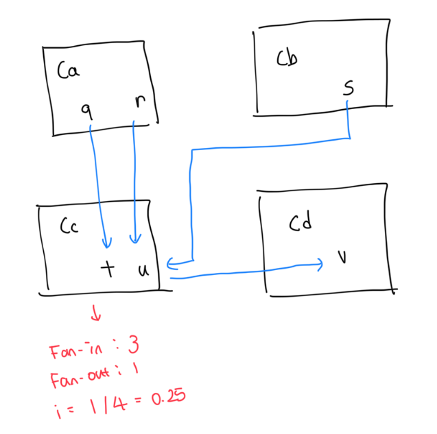
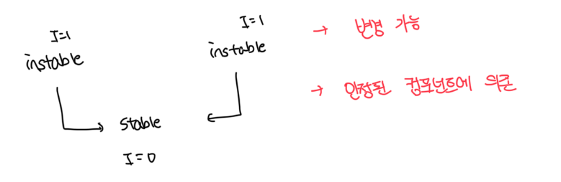
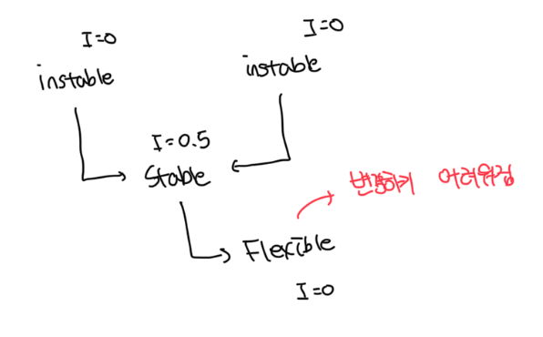

# ADP: 의존성 비순환 원칙

- 컴포넌트 의존성 그래프에는 `순환(Cycle)`이 있으면 안된다
- 순환의존성을 제거하기 위한 방법으로는 `주 단위 빌드`와 `의존성 비순환 원칙`이 있다

 

### 주 단위 빌드(Weekly Build)

- 1주에 4일은 작업을 하고 마지막 금요일에는 코드를 모두 통합해서 시스템을 빌드함
- 하지만 점점 하루만에 작업이 끝나지 않고 목요일에 빌드를 시도하거나 더 앞당기게된다
- 또한 처음엔 주 단위였지만 프로젝트 규모가 커질수록 통합시간도 늘어나 2주로 밀리곤한다
- 결국 통합과 테스트를 수행하기가 힘들어지고, 팀은 빠른 피드백이 주는 장점을 잃어버린다

 

### 순환 의존성 제거하기

- 개발 환경을 릴리스 가능한 컴포넌트 단위로 분리하는것이다
- 각 개발자는 컴포넌트를 만들때 마다 새로운 릴리스 버전을 부여하고, 다른 팀에서는 바로 적용할지 결정한다
- 한가지 참고해야되는 사항은 어느 컴포넌트에서 시작하더라도, 의존성 관계를 딸아가면서 최초의 컴포넌트로 돌아가는건 불가능함

 

#### 전형적인 컴포넌트 다이어그램

- `Presenters`를 담당하는 팀에서 컴포넌트의 새로운 릴리스를 만들면 `View`, `Main` 모두 영향을 받음
- `Main`이 변경되어도 밑에 있는 `Entities`나 `Database`는 전혀 영향이 없음
- `Presenters`를 만드는 개발자가 테스트를 하고자 하면 `Interactors`, `Entities`를 이용해서 빌드하면됨
- 시스템은 릴리스해야 할 때가 오면 릴리스 절차는 상향식으로 진행함
- 시스템 구성요소 간 의존성을 파악하고 있다면 시스템을 빌드하는 방법을 알 수 있음

 

### 순환이 컴포넌트 의존성 그래프에 미치는 영향

- 요구사항으로 인해 `Entities`에서 `Authorizer`에 의존하는 일이 발생한다고 가정한다
- 위 그래프 에서는 `순환 의존성(Dependency Cycle)`이 발생하게된다
- 결국 `Entities`, `Authorizer`, `Interactors`는 하나의 거대한 컴포넌트가 되어버림
- 이처럼 순환이 생기면 컴포넌트를 분리하기가 상당히 어려워진다

 

### 순환 끊기

#### DIP(의존성 역전 원칙) 적용하기

 

### 흐트러짐(Jitters)

- 앱이 성장하면서 의존성 구조는 서서히 흐트러지며 또 성장함
- 의존성 구조에 순환이 발생하는지 항상 관찰해야하고, 순환이 발생한다면 어떤 식으로든 끊어내야함

 

# 하향식(top-down) 설계

- 결국 컴포넌트 구조는 하양식으로 설계가 불가능하다
- 컴포넌트는 시스템에서 가장 먼저 설계할 수 있는 대상이 아니고, 시스템이 성장하고 변경될 때 진화한다
- 컴포넌트 의존성 다이어그램은 앱의 기능을 기술하는것과는 관련이 거의 없고 오히려 앱의 빌드가능성과 유지보수성을 보여준다
- 앱이 커지면서 변경되는 범위가 시스템의 가능한 한 작은 단위로 한정되기를 원한다
- 컴포넌트 의존성 구조는 시스템의 논리적 설계에 발맞춰 성장하며 또 진화해야한다

 

# SDP: 안정된 의존성 원칙

- 설계는 결코 정적일 수 없고 설계를 유지하다 보면 변경은 불가피함
- 변경이 쉽지 않은 컴포넌트가 변동이 예상되는 컴포넌트에 의존하게 만들면 절대로 안된다

 

### 안정성(Stability)

- 컴포넌트의 안쪽으로 들어오는 의존성이 많아지면 상당히 안정적이라고 볼 수 있음
- 사소한 변경이라도 의존하는 모든 컴포넌트를 만족시키면서 변경하려면 상당히 많은 노력이 듬

- 3개의 컴포넌트가 X에 의존한다. 즉 X 컴포넌트는 변경하지말아야 하는 이유가 3개나 존재한다
  - 이런 경우 X는 독립적이라고 말한다. X는 안정된 컴포넌트다
- Y는 3개의 컴포넌트에 의존한다. 즉 Y 컴포넌트는 변경이 발생할 수 있는 외부 요인이 3가지다
  - 이런 경우 Y는 의존적이라고 말한다. Y는 불안정한 컴포넌트다

 

### 안정성 지표

#### Fan-in

- 안으로 들어오는 의존성
- 컴포넌트 내부의 클래스에 의존하는 컴포넌트 외부의 클래스 개수를 나타냄

 

#### Fan-out

- 바깥으로 나가는 의존성
- 컴포넌트 외부의 클래스에 의존하는 컴포넌트 내부의 클래스 개수를 나타냄

 

#### I(불안정성)

- 공식 : `Fan-out` / (`Fan-in` + `Fan-out`)
- i가 0인 경우는 최고로 안정된 컴포넌트라는 뜻이다
  - 컴포넌트는 다른 컴포넌트를 책임지고 독립적이다
- i가 1인 경우는 최고로 불안정한 컴포넌트라는 뜻이다
  - 해당 컴포넌트의 경우 책임성이 없고 의존적이다

 

### 모든 컴포넌트가 안정적이어야 하는 것은 아니다

- 모든 컴포넌트가 최고로 안정적인 시스템이라면 변경이 불가능하다

 

#### SDP(안정된 의존성 원칙) 위반 사례

 

# SAP: 안정된 추상화 원칙

### 고수준 정책을 어디에 위치시켜야될까?

- 시스템에는 고수준 아키텍쳐나 정책결정 등 자주 변경해서는 안되는 소프트웨어가 존재한다
- 시스템에서 고수준 정책을 캡슐화하는 소프트웨어는 반드시 `안정된 컴포넌트(i = 0)`에 위치시켜야 한다
- 컴포넌트가 안정적이면서 동시에 변경에 충분히 대응할려면 해답은 `OCP(개방 폐쇠 원칙)`에서 찾을 수 있다
  - 추상 클래스는 확장이 충분이 가능할 정도로 클래스를 유연하게 만들수 있다

 

### 안정된 추상화 원칙

- 안정성(Stability)과 추상화 정도 사이의 관계를 정의한다
- 안정적인 컴포넌트라면 반드시 인터페이스와 추상 클래스로 구성되어 쉽게 확장이 가능해야한다
- 안정성이 결국 추상화를 의미한다고 말하는데 의존성은 추상화의 방향으로 흐르게된다
