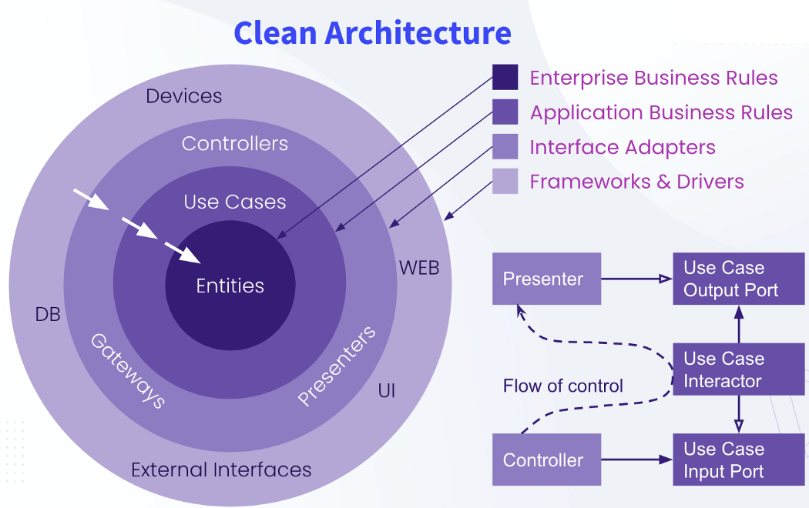
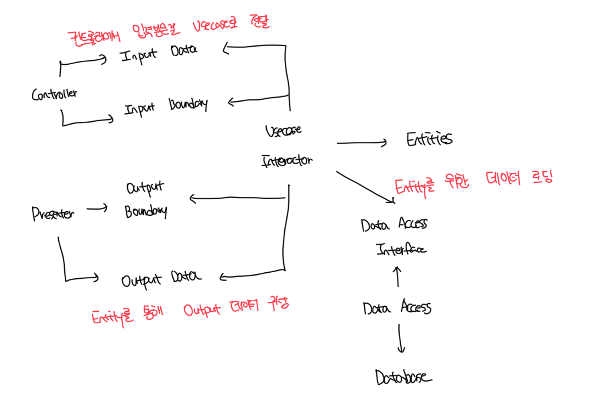

# 클린 아키텍쳐

- 클린 아키텍처의 최종 목표는 관심사의 분리다
- 소프트웨어를 계층으로 분리함으로써 관심사의 분리라는 목표를 달성할 수 있다
- 각 아키텍쳐는 최소한 업무 규칙을 위한 계층과 유저와 시스템 인터페이스를 위한 또 다른 계층 하나를 반드시 포함한다

 

# 의존성 규칙

- 위 그림에서 안으로 들어갈수록 고수준의 소프트웨어가 된다
- 이러한 아키텍처가 동작하도록 하는 가장 중요한 규칙은 의존성 규칙이다
- 소스 코드 의존성은 반드시 안쪽으로, 고수준의 정책을 향해야함
- 외부의 원에 속한 어떤것도 내부에서는 사용하면 안된다

 

### 엔티티

- 엔티티는 저사적인 핵심 업무 규칙을 캡슐화함
- 만약 단순한 단일 앱을 만드는 경우는 엔티티는 해당 앱의 업무 객체가 된다
- 이런 경우 엔티티는 가장 일반적이고 고수준인 규칙을 캡슐화한다
- 운영 괌점에서 특정 앱에 무언가 변경이 필요해도 엔티티 게층에는 절대로 영향을 주면 안된다

 

### 유스케이스

- 앱에 특화된 업무 규칙을 포함한다
- 유스케이스는 엔티티로 들어오고 나가는 데이터 흐름을 조정하고, 엔티티가 자신의 핵심 업무 규칙을 사용해서 유스케이스의 목적을 달성하도록 이끈다
- 유스케이스의 변경이 엔티티에 영향을 줘서는 안되고, 외부 요소에서 발생한 변경도 유스케이스에 영향을 줘서는 안된다

 

### 유스케이스 어댑터

- 어댑터는 데이터를 유스케이스와 엔티티에게 가장 편리한 형식에서 디비나 웹 같은 외부로부터 편리한 형식으로 변환한다
- 모델은 그저 데이터 구조 정도에 지나지않고 컨트롤러 -> 유즈케이스 -> 프레젠터/뷰로 돌아간다
- 해당 레이어에서는 어떤 코드도 디비에 대해 조금도 알아서는 안된다

 

### 프레임워크와 드라이버

- 일반적으로 바깥쪽 계층은 디비나 웹 프레임워크 같은 프레임워크나 도구들로 구성된다
- 프레임워크와 드라이버 등 은 모두 세부사항이다. 이를 외부에 위치시켜서 변경에 대한 피해를 최소화한다

 

### 원은 4개여야할까?

- 그림에는 4개지만 그 이상의 원이 필요할수도 있다
- 하지만 어떤 경우도 의존성 원칙은 적용되고, 소스 코드 의존 방향은 항상 안쪽을 향한다

 

### 경계 횡단하기

- 제어의 흐름과 의존성의 방향이 명백히 반대여야 하는 경우는 대체로 의존성 역전 원칙을 사용해서 해결한다

 

### 경계를 횡단하는 데이터는 어떤 모습인가

- 경계를 가로지르는 데이터는 흔히 간단한 데이터 구조로 이뤄진다
- 기본적인 구좇나 간단한 데이터 전송 객체(Data Transfer Object)등 원하는 대로 고를 수 있다
- 이러한 데이터는 디비에 의존하면 안되고, 데이터는 항상 내부의 원에서 사용하기에 가장 편리한 형태를 가져야한다

 

# 전형적인 시나리오

 

# 결론

- 간단한 규칙들은 준수하면 향수에 겪을 수많은 고통거리를 덜어준다
